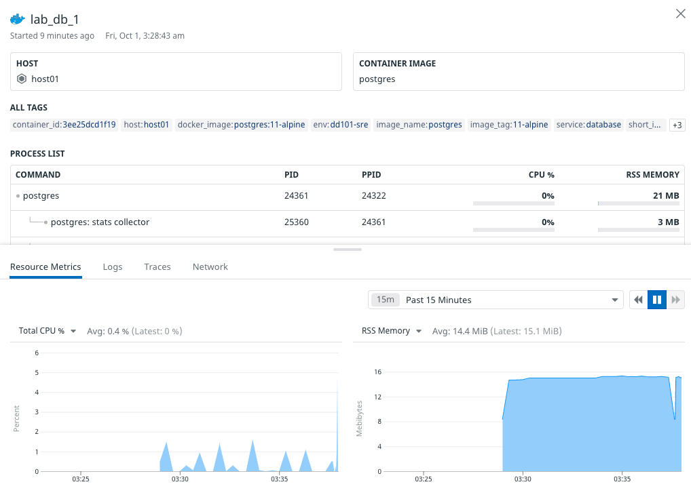
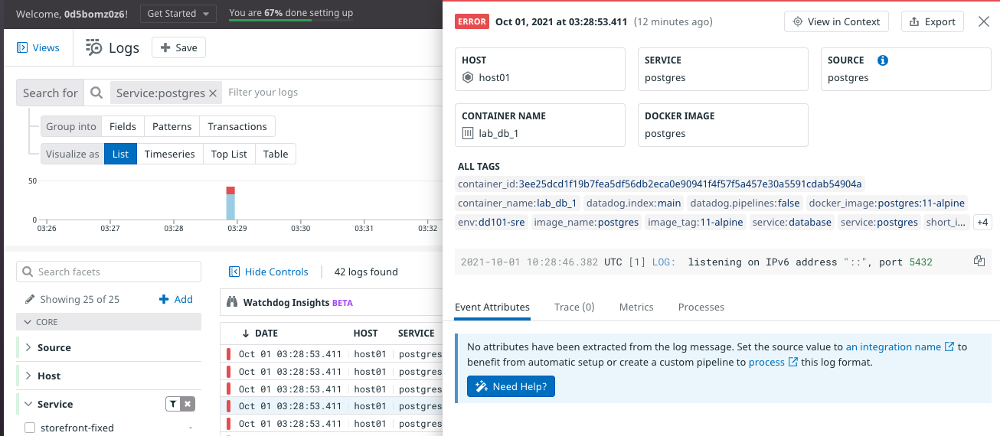
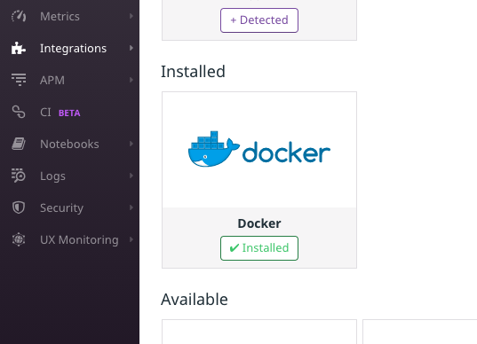
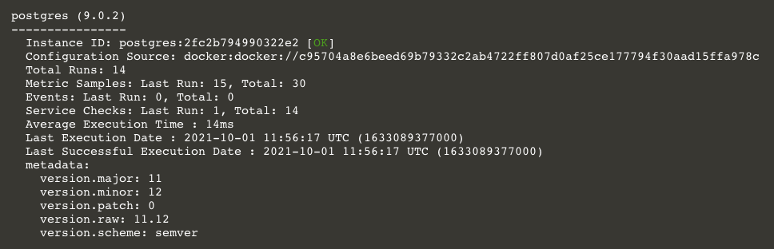
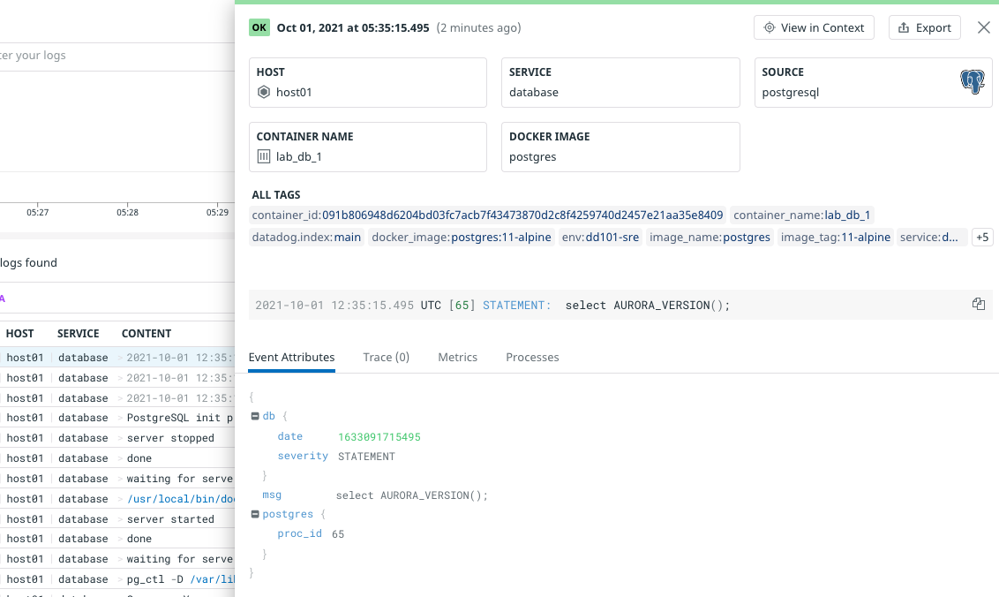

Storedog is running in Docker and the Agent is collecting data from the services running in containers. Currently, the Agent doesn't know what type of services they are. 

Integrations help the Agent be more precise about the services it's monitoring. You'll focus on the PostgreSQL integration in this lab because it's a popular example of a Datadog core integration, and you have experience configuring it in the "Install the Agent on Docker" lab.

In the terminal, run `docker-compose ps`{{execute}}. You can see that the Storedog containers are already running, and the container named `lab_db_1` is running PostgreSQL. 

Open Datadog’s [Containers](https://app.datadoghq.com/containers) page. Click on container `lab_db_1` to examine its details.

The Agent can see what processes are running in the db container (e.g., `postgres: stats collector`), but it needs some help identifying this as a known integration.

Open the [Logs Explorer](https://app.datadoghq.com/logs) and filter the results by clicking on the `postgres` service in the facet panel on the left. If you don't see any entries, increase the timeframe to **Past 1 Hour** in the dropdown at the top of the page.

There's a helpful note at the bottom of this log line detail. 

> No attributes have been extracted from the log message. Set the source value to an integration name to benefit from automatic setup...

You'll do that shortly.

### Viewing existing integrations

Before configuring the PostgreSQL service, take a look at the integrations Datadog has installed for you automatically.

1. Navigate to the [Integrations](https://app.datadoghq.com/account/settings#integrations) page. 

2. Under **Installed**, you should see **Docker**, with an indicator that it's installed. This is one of the integrations that Datadog can install without configuration. The Agent recognizes it as soon as it mounts the `docker.sock` file from the host that we mentioned when starting the lab, and which you configured in the "Agent on Docker" lab earlier.

    

    Mounting `docker.sock` in the Agent container also enables Autodiscovery for all the containers that the Docker Daemon is running. The  Agent will use each container's Autodiscovery labels to configure checks for it. Autodiscovery label keys start with `com.datadoghq.ad`, as you'll see below. 

3. Installing the PostgreSQL Integration involves some configuration. To see the instructions, type `postgres`{{copy}} into the search field at the top of the Integrations page. 

4. Click on the PostgreSQL card, and then click on the **Configuration** tab. Under **Prepare Postgres**, there are `psql` commands to create a user for the Agent to query statistics. These commands were already run for you when the lab started.

5. Scroll down to the **Docker** section and look at the **Metric collection**, **Log collection**, and **Trace collection** instructions. You'll perform these steps next.  

### Configure the Postgres Integration

Following the instructions from the Postgres Integration:

1. Open `docker-compose.yml`{{open}} in the IDE and find the `db` service section.

2. The following Autodiscovery labels have been adapted for `docker-compose.yml`. Add them to the `labels` block of the `db` service.

    <pre class="file" data-filename="docker-compose.yml" data-target="insert" data-marker="# postgres integration template here">
   com.datadoghq.ad.check_names: '["postgres"]'
         com.datadoghq.ad.init_configs: '[{}]'
         com.datadoghq.ad.instances: '[{"host":"%%host%%", "port":5432,"username":"datadog","password":"datadog"}]'</pre>

    These Autodiscovery labels tell the Agent to run the `postgres` check on this container, and provide the credentials for querying metrics.

3. Add this line to the same `labels` section:

    <pre class="file" data-filename="docker-compose.yml" data-target="insert" data-marker="# postgres logs label here">
   com.datadoghq.ad.logs: '[{"source": "postgresql", "service": "database"}]'</pre>

    This tells Datadog to use the PostgreSQL integration's log pipeline to parse this service's logs more intelligently, and to tag the log lines with `service:database`.

4. Finally, you need to add an environment variable to the `datadog` service. Click the following line and add it to the `environments` block:

    <pre class="file" data-filename="docker-compose.yml" data-target="insert" data-marker="# agent non-local apm here">
   - DD_APM_NON_LOCAL_TRAFFIC=true</pre>

    This configures the Agent to observe other containers' performance at the application level.

### See the Results

1. In the terminal, run `docker-compose down && docker-compose up -d`{{execute}} to restart the stack.

2. After docker-compose finishes restarting, check the Datadog Agent status with the command `docker-compose exec datadog agent status`{{execute}}.

3. Scroll up to the **Running Checks** section and find the new **postgres** section:

    

    If you don't see it on the first run, the Agent was still starting up. Rerun the command and you should see it.

4. Return to the <a href="https://app.datadoghq.com/account/settings#integrations" target="_datadog">**Integrations**</a> page in Datadog. You should see that the Postgres Integration is now installed. Click the card again and open the **Metrics** tab. These are the new metrics available, thanks to this integration.

5. Navigate to <a href="https://app.datadoghq.com/metric/explorer" target="_datadog">**Metrics > Explorer**</a>. In the **Graph** field, type `postgres.table.count` and hit the Enter key. You should see a steady graph of four tables over time.

6. Navigate to <a href="https://app.datadoghq.com/dashboard/lists" target="_datadog">**Dashboards**</a> and find **Postgres - Overview** and **Postgres - Metrics**. These are pre-made dashboards provided by the integration. Open them to see what they provide.

7. Navigate to the <a href="https://app.datadoghq.com/logs" target="_datadog">**Logs**</a> page and click the new `database` service facet on the left-hand side to filter the log lines for that service tag. This is the service formerly tagged as `postgres`. You will still see the old `postgres` service tags if you set the time frame dropdown to **Past 1 Hour** or more.

8. Click on a log line and look at the detail panel. You can see that it's correctly identified as the `database` service and that the **Event Attributes** are formatted as JSON. This is a benefit of the logs pipeline that was installed when Datadog detected this integration.

    

9. Navigate to <a href="https://app.datadoghq.com/logs/pipelines" target="_datadog">**Logs > Configuration**</a> and click on the new **Postgresql** pipeline to see how logs are processed.

Click the **Continue** button to configure integrations for the remaining services. 
