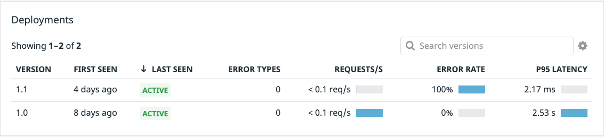

With all the necessary tooling setup and our deployment up and running, let's take a look at our application with Datadog's distributed tracing and APM.

Navigate to <a href="https://app.datadoghq.com/apm/traces"> APM > Traces</a>, where traces should start flowing in within a minute. Once the traces start coming in you may need to wait about two minutes as Datadog's Autodiscovery feature picks up the traces that are coming in and populates the Services page. We can go to the <a href="https://app.datadoghq.com/apm/services"> APM > Services</a> page and you should see a list of the services that comprise Storedog once Autodiscovery has picked them up from traces. Change the timeline to `Past 15 Minutes` in the top right of the page, and now click the `advertisements` service. This will bring up a page showing many different aspects of our `advertisements` service including `Total Requests`, `Total Errors`, `Latency` and more. 

Looking at the latency for this service shows a staggering 2.5 second response time, for our customers that is an unacceptable lag. Looking down just below the `Latency Distribution` graph you should see the `Deployments` section. 

Version 1.0 of our `advertisements` service is running, to the far right you will see its very high P95 latency. Since we currently only have one version deployed, we cannot get any kind of deployment comparison data, so lets get our latency fixed and see if we can make an improvement over our `1.0` deployment.

Our engineers have gone ahead and built a new advertisements image for us, which should *hopefully* fix our latency issues. Now that we have our new image, we can use the new manifest provided by our team of engineers.

Let's make sure we have updated the version tag to `1.1` and given the deployment and service a name to help delineate it from the previous version.

1. Click the `IDE` tab on the right above the terminal and open `/root/k8s-yaml-files/advertisements_1_1.yaml`{{open}}

1. On lines 10 and 29 you should see a version number provided of `1.0`. We need to update this to `1.1` so that Datadog will recognize this as a new versioned deployment and give us data specific to this deployment. `Version` is one of three Unified Service Tags reserved by Datadog, you can read more about these tags <a href="https://docs.datadoghq.com/getting_started/tagging/unified_service_tagging/?tab=kubernetes">here</a>.

1. On lines 12 and 84 you should see the name of our deployment and service respectfully. Let's update both of these names to be `advertisementsv11`.

1. With our new kubernetes manifest ready, we can now deploy version `1.1` of the `advertisements` service by running the command: `kubectl apply -f k8s-yaml-files/advertisements_1_1.yaml`{{execute}}. You should see a new Deployment and Service were created in the terminal output.

1. Next, let's be sure our new deployment and service are running using `kubectl get all`{{execute}}. It may take anywhere from thirty seconds to one minute for the new deployment/service to show as 'running'

Great! Version 1.1 of our `advertisements` service has been deployed. With the service running, open the <a href=https://app.datadoghq.com/apm/traces>APM > Traces</a> page and on the left-hand menu under `Service` choose `advertisements`. Below that click the `Version` drop down and click `1.1`. Once traces start flowing in that means we are getting traffic to this newer deployment. Lets go back over to the <a href=https://app.datadoghq.com/apm/service/advertisements>APM > Services > advertisements</a> page and after a few minutes we should be able to observe a `1.0` and `1.1` Deployment Version.

**Note**: It may take a few minutes for the new Version to show up in the Deployment section of APM > Services.

Looking at our Deployment panel, we can see that while our latency is way down, our error rate is quickly rising to a very high percentage of attempted requests! This is not a good result for an attempted fix.

Thankfully we used pseudo Canary deployment, in which only a subset of our users will ingest the updated `1.1` service, while the rest of the traffic will continue to ingest the original `1.0` service. Using a Canary deployment gives us some time to evaluate the health of this new deployment, and if things go wrong we can quickly revert the deployment, and if things go well we can shift all of our traffic to our Canary.

**Note**: If you do not see a version `1.1` deployment, it may take a minute or so to have new traffic hit the `1.1` service and show up in the platform.
