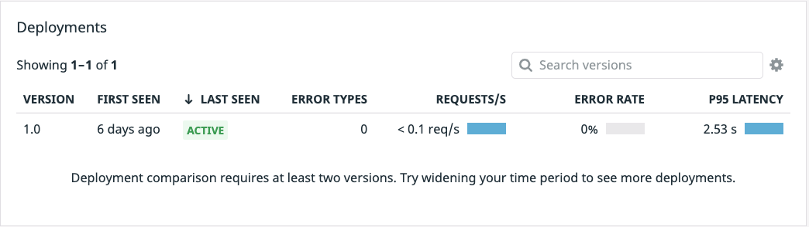

With the application running and the Datadog agents installed, navigate to [APM > Traces](https://app.datadoghq.com/apm/traces?env=ruby-shop). You may need to wait a minute or so for data to show up in Datadog. Once traces begin flowing in, navigate to the [APM > Services](https://app.datadoghq.com/apm/services?env=ruby-shop) page and you should see a list of the services that comprise Storedog. 

With the [Service List](https://app.datadoghq.com/apm/services?env=ruby-shop), we get a high level view of overall service performance and can quickly see services that are running slower than the rest. When working with a team migrating to microservices, this view can be a great first approach to breaking down existing problems. 

1. If we look at the [Frontend Service](https://app.datadoghq.com/apm/service/store-frontend), we can see errors coming in by navigating to the [APM > Traces](https://app.datadoghq.com/apm/traces?start=1620938913331&end=1620939813331&paused=false) page. Now on the left hand side, filter the facets for `Status > Error` and `Service > store-frontend`. Errors are not a good experience for our end users. 

Looking down just below the `Latency Distribution` graph you should see the `Deployments` section. 

2. Let's go ahead and click on one of our traces to bring up the full view. We can see when investigating the flame graph that there is a template error coming in. 

3. We can go directly from this view to our Frontend Service page to see if we can pinpoint what is going on. 

4. Now that we are on the Frontend Service page, we can scroll down to the endpoints panel and see there are two endpoints in particular that are substantially slower than the rest...

Both the `HomeController#index` and the `ProductController#show` endpoints are showing *much* longer latency times. If we click in and view a trace, we'll see that we've got a downstream microservice taking up a substantial portion of our time.

Now, head back to the [APM > Services](https://app.datadoghq.com/apm/services?env=ruby-shop). Clicking the `advertisements` service, looking down just below the `Latency Distribution` graph you should see the `Deployments` section. 

Version `1.0` of the `advertisements` deployment is running and to the far right you will see its very high P95 latency. `P95` refers to the 95th percentile of latency. This means that 95% of your users are experiencing a latency equal to the P95 latency or lower. 

Since we currently only have one version deployed, there is no way to get any kind of deployment comparison data. The latency issue will need to be fixed to see if an improvement can be made over the `1.0` deployment, fixing the latency and application crashes. 

Thankfully, the engineers have gone ahead and built a new advertisements image, and even provided a new manifest which should *hopefully* fix users latency issues. Let's make sure we have updated the version tag to `1.1` so Datadog will pickup the change and start gathering data on the new deployment.

1. First, copy the new manifest into the `k8s-yaml-files` directory. `cp /root/new-manifests/advertisements_1_1.yaml /root/k8s-yaml-files/advertisements.yaml`{{execute}}

1. Click the `IDE` tab on the right above the terminal and open `/root/k8s-yaml-files/advertisements.yaml`{{open}}

1. On lines 9 and 26 you'll see the engineering team didn't update the version number, so it's `1.0`. We need to update this to `1.1` so that Datadog will recognize this as a new versioned deployment and give us data specific to this deployment. `Version` is one of three Unified Service Tags reserved by Datadog, you can read more about these tags [here](https://docs.datadoghq.com/getting_started/tagging/unified_service_tagging/?tab=kubernetes).

1. With our new kubernetes manifest ready, we can now deploy version `1.1` of the `advertisements` service by running the command: `kubectl apply -f k8s-yaml-files/advertisements.yaml`{{execute}}. You should see a new Deployment was created in the terminal output.

1. Next, let's be sure our new deployment is ready using `kubectl get deployment advertisements-canary`{{execute}}. It may take anywhere from 10 seconds to one minute for the new deployment to show as 'Ready'. In the end you will see your deployment with the name `advertisements-canary`.

Great! Version `1.1` of `advertisements` has been deployed. With the deployment running, open the [APM > Traces](https://app.datadoghq.com/apm/traces?env=ruby-shop) page and on the left-hand menu under `Service` choose `advertisements`. Below that click the `Version` drop down and click `1.1`. Once traces start flowing in, that means you are getting traffic to your newer deployment. Head back over to the [APM > Services > advertisements](https://app.datadoghq.com/apm/service/advertisements?env=ruby-shop) page and after a few minutes you should be able to observe a `1.0` and `1.1` Deployment Version.

**Note**: It may take a few minutes for the new version of the application to show up in the Deployment section of APM > Services.

Looking at your Deployment panel, you'll see that while the latency is way down, the error rate is quickly rising to a very high percentage of attempted requests! This is not a good result for an attempted fix.

**Note**: If you do not see a version `1.1` deployment, it may take a minute or so to have new traffic hit the `1.1` service and show up in the platform.
