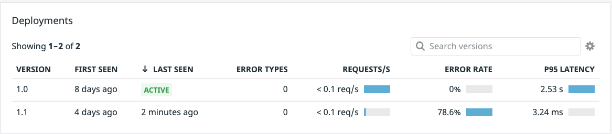
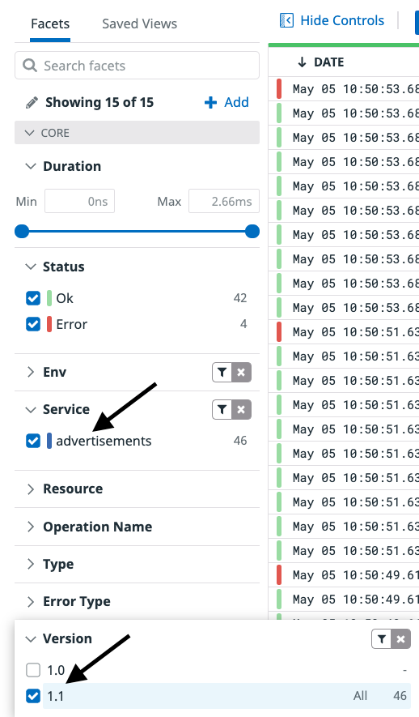
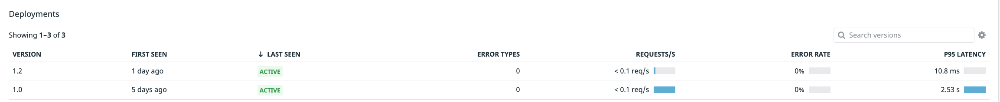
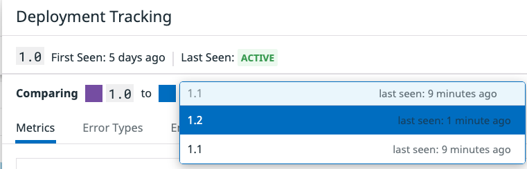
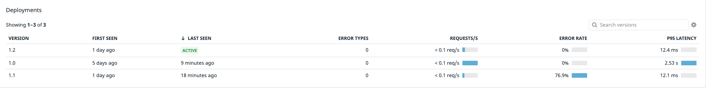

With both the `1.0` and `1.1` versions running and showing in the `Deployment` pane, click on the `1.0` deployment. Deployment Tracking for Datadog distributed tracing and APM tracks all versions deployed over the last 30 days, giving you a wide window for continuous deployment analysis. Datadog automatically provides out-of-the-box graphs that visualize RED (requests, errors, and duration) metrics across versions, making it easy to spot problems in your services and endpoints before they turn into serious issues.

From the image above you can see the high latency shown in purple as opposed to the much lower latency shown in blue. In the `Error Rate by Version` we can see an error trend in the `1.1` (blue) deployment where you will see zero errors, or no purple line, for the `1.0`.

You need to take down the deployment of the `1.1` advertisements service before too many customers experience errors and it becomes a problem. Thankfully, the canary-like strategy used here has decreased the blast radius.

In the terminal to the right, execute the following command: `kubectl delete deployments.apps advertisementsv11 && kubectl delete service advertisementsv11 && kubectl delete pod <name of advertisements v11 pod>`. Be sure to replace the `<name of advertisements v1.1 pod>` with the specific name of your pod. You can easily find the name of your pods with `kubectl get pods`{{execute}}.

Heading back over to the <a href=https://app.datadoghq.com/apm/service/advertisements>APM > Services > advertisements</a> page, looking down at your Deployments you should shortly see that only the version `1.0` is `Active`. 

Now that you have taken down the bad deployment and ensured no users will encounter any errors, you can get a new image from the engineering team. So while your users are still experiencing a bit of lag in load times, at least they are not experiencing any outright errors.

With the failure of version `1.1`, word of a new useable and tested image from the engineering team has been quickly handed down. Again, they have provided a new manifest you will still need to update the version number and name. If you do not update the version numbers and name, you will not receive proper data about this specific version you are about to deploy. Remember, Datadog Deployment tracking relies on the reserved  `version` tag, and if it is not properly updated you will not receive relevant data for this new deployment.

1. First copy the new manifest into the `k8s-yaml-files` directory. `cp /root/new-manifests/advertisements_1_2.yaml /root/k8s-yaml-files/advertisements.yaml`{{execute}}

1. In the IDE on the right, open your newly copied manifest `/root/k8s-yaml-files/advertisements.yaml`{{open}}.

1. On lines 9 and 26, update the version numbers from `1.1` to `1.2`. This will tag this specific deployment 

1. On lines 10 and 80 update the name of the deployment and service to `advertisementsv12`.

Now you can deploy what is hopefully going to be a minor update that gives your end user the latency they deserve! Apply the `1.2` manifest using `kubectl apply -f k8s-yaml-files/advertisements.yaml`{{execute}}. 

Just like earlier, you can use `kubectl get all`{{execute}} to get the status of all of your kubernetes resources and ensure that the new `advertisementsv12` service is fully up and running. Once it is, open the <a href=https://app.datadoghq.com/apm/traces>APM > Traces</a> page and on the left-hand menu under `Service` choose `advertisements`. Below that click the `Version` drop down and click `1.2`. Once traces start flowing in that means we are getting traffic to this newer deployment. 

Now you can go back to the<a href=https://app.datadoghq.com/apm/service/advertisements>APM > Services > advertisements</a> page and within a few minutes you should see your new `1.2` deployment running alongside your `1.0`

Excellent! We can see from a glance that the `1.2` deployment has lowered the latency way down for this service, and the error rate is back down to normal.You can make a final check by comparing the `1.2` deployment to its previous `1.0` version. Click on the version `1.0` deployment to bring up the Deployment Tracking panel. At the top left choose to compare `1.0` to `1.2` using the dropdown.

Comparing the two we can see there are no errors in the `Error Rate by Version` pane and the `Latency by Version` shows a very promising reduction in latency, down to ~10ms. That is excellent and our users will be very happy!

The final steps will be to take down our `1.0` deployment, and shift all traffic to our stable `1.2` deployment.

1. Back in the terminal, execute the following command to take down your `1.0` deployment. `kubectl delete deployments.apps advertisements && kubectl delete service advertisements && kubectl delete pod <name of advertisements v1 pod>`.

1. With that down, we need to be sure that all traffic runs to the updated `1.2` deployment. Open the IDE tab and navigate to the `k8s-yaml-files/advertisements.yaml`{{open}}. 

1. On lines 10 and 80, rename `advertisementsv12` to `advertisements`. The `Version` tag you have been modifying will handle tracking what version of the service is running on the Datadog Platform.

1. After making these changes, reapply the version `1.2` manifest. With the `1.2` service already running, `kubectl apply -f k8s-yaml-files/advertisements.yaml`{{execute}} will reconfigure our service and deployment with the new name. Within a few minutes, the only running deployment you should see in <a href=https://app.datadoghq.com/apm/service/advertisements>APM > Services > advertisements</a> will be the `1.2` version.

At a glance we can see an 0% error rate along with a drastically lower latency.

1. Lastly, we can take down the canary as all traffic has now been shifted to the main `advertisements` service which has been upgraded to version `1.2`. Using `kubectl delete deployments.apps advertisementsv12 && kubectl delete service advertisementsv12 && kubectl delete pod <name of advertisements v12 pod>`.

