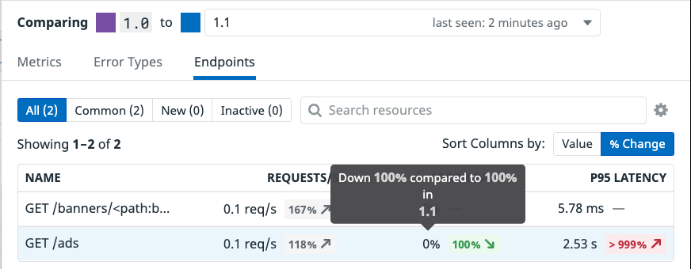
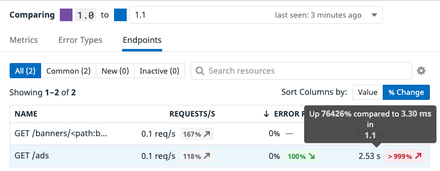
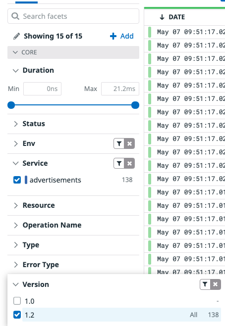
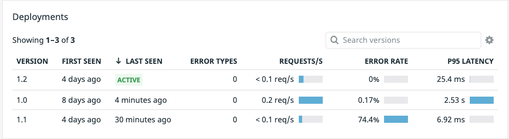

With both the `1.0` and `1.1` versions running and showing in the `Deployment` pane, click on the `1.0` deployment. Deployment Tracking for Datadog distributed tracing and APM tracks all versions deployed over the last 30 days, giving you a wide window for continuous deployment analysis. Datadog automatically provides out-of-the-box graphs that visualize RED (requests, errors, and duration) metrics across versions, making it easy to spot problems in your services and endpoints before they turn into serious issues.

From the image above you can see the high latency shown in purple as opposed to the much lower latency shown in blue. In the `Error Rate by Version` we can see an error trend in the `1.1` (blue) deployment where you will see zero errors, or no purple line, for the `1.0`. 

Let's quickly dig in and investigate this a bit more to see whats going on. From the `Metrics` tab, click the `Endpoints` tab. This will show you the endpoints associated with this service, the requests per second coming in, the error rate, along with the P95 Latency. These are all comparisons between another chosen version, so you can see how error rates and latency differ between deployments. We can see that our `Error Rate` when looking at the `1.0` deployment has a `100%` reduction in errors from the newer `1.1` deployment, along with the p95 latency being over `1000%` higher

You need to take down the deployment of the `1.1` advertisements service before too many customers experience even more errors and it becomes a serious problem. Thankfully, the canary-like strategy used here has decreased the blast radius.

1. In the terminal to the right, execute the following command: `kubectl delete deployments advertisements-canary`{{execute}}.

Heading back over to the [APM > Services > advertisements](https://app.datadoghq.com/apm/service/advertisements) page, looking down at your Deployments you should shortly see that only the version `1.0` is `Active`. 

Now that you have taken down the bad deployment and ensured no users will encounter any errors, you can get a new image from the engineering team. So while your users are still experiencing a bit of lag in load times with some infrequent errors, at least they are not experiencing constant errors.

With the failure of version `1.1`, word of a new useable and tested image from the engineering team has been quickly handed down. Again, they have provided a new manifest, but you will still need to update the version number. If you do not update the version numbers, you will not receive proper data about this specific version you are about to deploy. Remember, Datadog Deployment tracking relies on the reserved  `version` tag, and if it is not properly updated you will not receive relevant data for this new deployment.

1. First copy the new manifest into the `k8s-yaml-files` directory. `cp /root/new-manifests/advertisements_1_2.yaml /root/k8s-yaml-files/advertisements.yaml`{{execute}}

1. In the IDE on the right, open your newly copied manifest `/root/k8s-yaml-files/advertisements.yaml`{{open}}.

1. On lines 9 and 26, update the version numbers from `1.1` to `1.2`. This is the tag that allows Datadog to track the version. 

Now you can deploy what is hopefully going to be a minor update that gives your end user the latency, error free experience they deserve! Apply the `1.2` manifest using `kubectl apply -f k8s-yaml-files/advertisements.yaml`{{execute}}. 

Just like earlier, you can use `kubectl get deployment advertisements-canary`{{execute}} to get the status of the new `advertisements-canary` deployment. Once it is ready, open the [APM > Traces](https://app.datadoghq.com/apm/traces?env=ruby-shop) page and on the left-hand menu under `Service` choose `advertisements`. Below that click the `Version` drop down and click `1.2`. Once traces start flowing in that means we are getting traffic to this newer deployment. 

Now you can go back to the [APM > Services > advertisements](https://app.datadoghq.com/apm/service/advertisements?env=ruby-shop) page and within a few minutes you should see your new `1.2` deployment running alongside your `1.0`

Excellent! We can see from a glance that the `1.2` deployment has lowered the latency way down for this service, and the error rate is back down to normal. We can quickly check our `store-frontend` service to ensure there is no errors with our new lower latency. Navigate back to the [APM > Traces](https://app.datadoghq.com/apm/traces?env=ruby-shop) page. On the left hand side navigation filter for `Service > store-frontend`. No errors should be coming in.

You can make a final check by comparing the `1.2` deployment to its previous `1.0` version. Navigate back to the `Services` page and click on the version `1.0` deployment to bring up the Deployment Tracking panel. At the top-left choose to compare `1.0` to `1.2` using the dropdown.

Comparing the two we can see there are no errors in the `Error Rate by Version` pane and the `Latency by Version` shows a very promising reduction in latency, down to ~10ms. That is excellent and your users will be very happy!

The final step will be to take down the `1.0` deployment, shifting all traffic to your stable `1.2` deployment.

1. Back in the terminal, execute the following command to take down your `1.0` deployment. `kubectl delete deployment advertisements`{{execute}}. Now the only running deployment should be our `advertisements-canary` which we know is our stable version `1.2` deployment. You can verify this by checking the Deployments panel on the [APM > Services > advertisements](https://app.datadoghq.com/apm/service/advertisements?env=ruby-shop) page.

At a glance we can see an 0% error rate along with a drastically lower latency.
