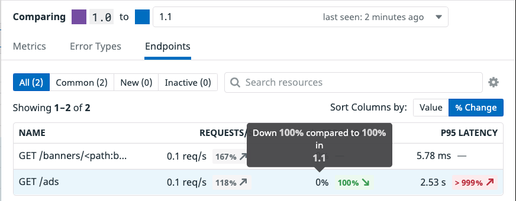
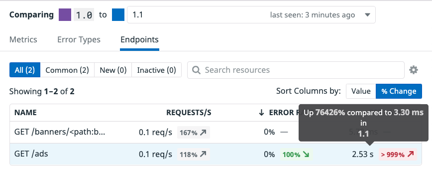

With both the `1.0` and `1.1` versions running and showing in the `Deployment` pane, we can now compare the two. 

1. Click on the `1.0` deployment. 

  Deployment Tracking for Datadog distributed tracing and APM tracks all versions deployed over the last 30 days, giving you a wide window for continuous deployment analysis. Datadog automatically provides out-of-the-box graphs that visualize RED (requests, errors, and duration) metrics across versions, making it easy to spot problems in your services and endpoints before they turn into serious issues.

2. From the image above you can see the high latency shown in purple as opposed to the much lower latency shown in blue. In the `Error Rate by Version` we can see an error trend in the `1.1` (blue) deployment where you will see zero errors, or no purple line, for the `1.0`. Let's quickly dig in and investigate this a bit more to see whats going on. 

3. From the `Metrics` tab, click the `Endpoints` tab. This will show you the endpoints associated with this service, the requests per second coming in, the error rate, along with the P95 Latency. These are all comparisons between another chosen version, so you can see how error rates and latency differ between deployments. We can see that our `Error Rate` when looking at the `1.0` deployment has a `100%` reduction in errors from the newer `1.1` deployment, along with the p95 latency being over `1000%` higher

You need to take down the deployment of the `1.1` advertisements service before too many customers experience even more errors and it becomes a serious problem. Thankfully, the canary-like strategy used here has decreased the blast radius.

4. In the terminal to the right, execute the following command: `kubectl delete deployments advertisements-canary`{{execute}}.

Heading back over to the [APM > Services > advertisements](https://app.datadoghq.com/apm/service/advertisements) page, looking down at your Deployments you should shortly see that only the version `1.0` is `Active`. 

Now that you have taken down the bad deployment and ensured no users will encounter any errors, you can get a new image from the engineering team. So while your users are still experiencing a bit of lag in load times with some infrequent errors, at least they are not experiencing constant errors.

With the failure of version `1.1`, word of a new useable and tested image from the engineering team has been quickly handed down. Again, they have provided a new manifest, but you will still need to update the version number. If you do not update the version numbers, you will not receive proper data about this specific version you are about to deploy. Remember, Datadog Deployment tracking relies on the reserved  `version` tag, and if it is not properly updated you will not receive relevant data for this new deployment.

5. First copy the new manifest into the `k8s-yaml-files` directory. `cp /root/new-manifests/advertisements_1_2.yaml /root/k8s-yaml-files/advertisements.yaml`{{execute}}

6. In the IDE on the right, open your newly copied manifest `/root/k8s-yaml-files/advertisements.yaml`{{open}}.

7. On lines 9 and 26, update the version numbers from `1.1` to `1.2`. This is the tag that allows Datadog to track the version. 

Now you can deploy what is hopefully going to be a minor update that gives your end user the latency, error free experience they deserve! Apply the `1.2` manifest using `kubectl apply -f k8s-yaml-files/advertisements.yaml`{{execute}}. 

In the next step we will take a look at our new `advertisements-canary` deployment.
