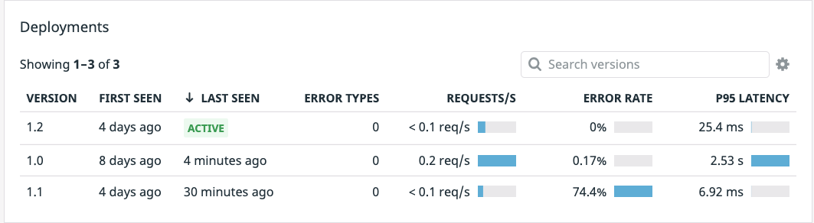

Just like earlier, you can use `kubectl get deployment advertisements-canary`{{execute}} to get the status of the new `advertisements-canary` deployment. Once it is ready, open the [APM > Traces](https://app.datadoghq.com/apm/traces?env=ruby-shop) page and on the left-hand menu under `Service` choose `advertisements`. Below that click the `Version` drop down and click `1.2`. Once traces start flowing in that means we are getting traffic to this newer deployment. 

Now you can go back to the [APM > Services > advertisements](https://app.datadoghq.com/apm/service/advertisements?env=ruby-shop) page and within a few minutes you should see your new `1.2` deployment running alongside your `1.0`

Excellent! We can see from a glance that the `1.2` deployment has lowered the latency way down for this service, and the error rate is back down to normal. We can quickly check our `store-frontend` service to ensure there is no errors with our new lower latency. Navigate back to the [APM > Traces](https://app.datadoghq.com/apm/traces?env=ruby-shop) page. On the left hand side navigation filter for `Service > store-frontend`. No errors should be coming in.

You can make a final check by comparing the `1.2` deployment to its previous `1.0` version. Navigate back to the `Services` page and click on the version `1.0` deployment to bring up the Deployment Tracking panel. At the top-left choose to compare `1.0` to `1.2` using the dropdown.

Comparing the two we can see there are no errors in the `Error Rate by Version` pane and the `Latency by Version` shows a very promising reduction in latency, down to ~10ms. That is excellent and your users will be very happy!

The final step will be to take down the `1.0` deployment, shifting all traffic to your stable `1.2` deployment.

1. Back in the terminal, execute the following command to take down your `1.0` deployment. `kubectl delete deployment advertisements`{{execute}}. Now the only running deployment should be our `advertisements-canary` which we know is our stable version `1.2` deployment. You can verify this by checking the Deployments panel on the [APM > Services > advertisements](https://app.datadoghq.com/apm/service/advertisements?env=ruby-shop) page.

At a glance we can see an 0% error rate along with a drastically lower latency. This concludes our workshop. Thanks for attending!