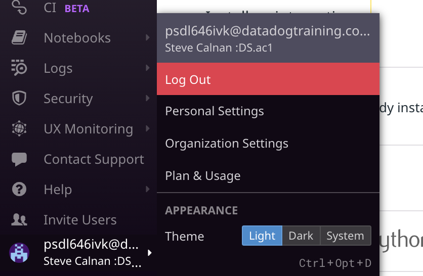
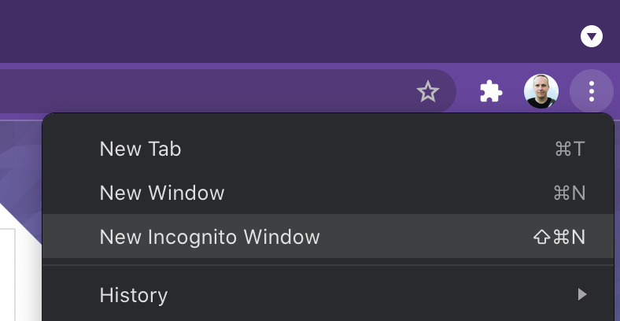
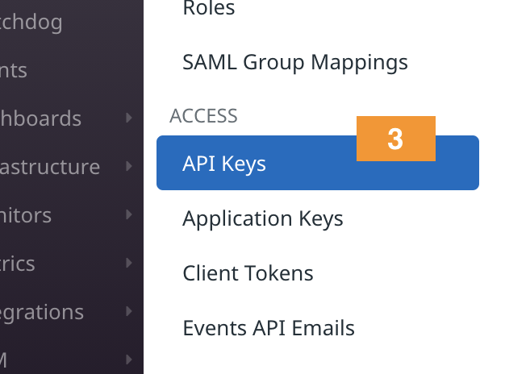
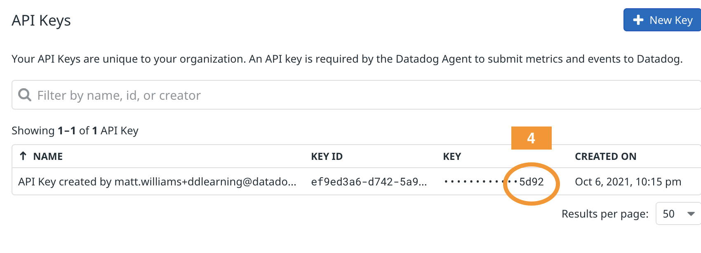

It may take the lab environment a minute or two to get set up. Begin working your way through the following steps when you see the `Provisioning Complete` message in the terminal to your right.

1. Take a look at the command listed below. See the little curled arrow icon that appears next to it? That means it's a **clickable command**. Click it and the command will be copied to the terminal and executed.

  `ls -la`{{execute}}

2. The lab instructions are on the left.

  A terminal and Visual Studio Code IDE tabs are on the right.

  Whenever working in the IDE, your work will be **saved automatically**.

  You'll also find a tab titled "storedog", which you'll learn more about soon.

3. On the right side in the terminal you should see login credentials for the account we created for you. Later, if you forget the login information, run `creds`{{execute}} and you will see the information again.

  Login to your <a href="https://app.datadoghq.com" target="_datadog">**Datadog account**</a> using the credentials in the terminal.

  **Tips:**

  - You must use app.datadoghq.**com**

  - Make sure you are logged out of other organizations

    

  - You can use an incognito window to escape SSO

    

4. Take a look around. We will be trying out many of the sections during this training.

5. Verify that you are in the right organization. Visit [the API Keys section](https://app.datadoghq.com/organization-settings/api-keys), which you can find in the Global Navigation under **User > Organization Settings**.

  

  Under **ACCESS**, click **API keys**.

  

  Make note of the exposed alphanumeric characters at the end of the API key.

  

6. In the Training Lab terminal, run the command `echo $DD_API_KEY`{{execute}} to see the API key environment variable. Verify that the last 4 alphanumeric characters match what you saw in the Datadog app.

  If this is not the same API key that you saw in your Datadog account, you may be logged into the wrong account. Make sure you use the credentials provided by `creds`{{execute}}.

7. Now that you have verified that you are in the correct organization, move on to learn about the application you'll use to learn about the Datadog platform.
