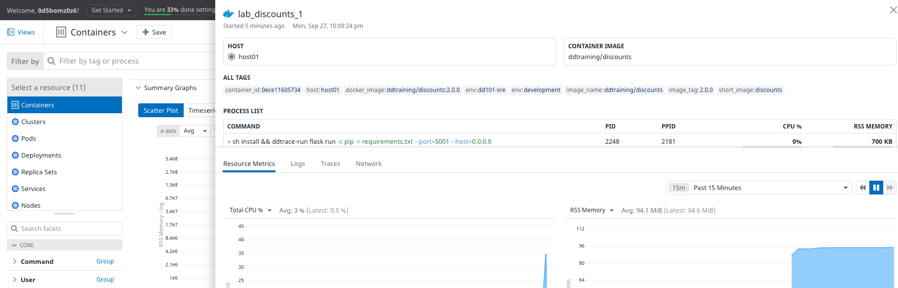
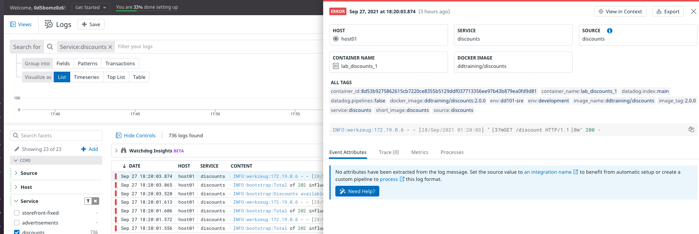

"Installing" the Agent container is done by specifying which Docker image to use. Rather than configuration files, the container Agent relies on environment variables and container labels, which you'll implement in this lab.

### Configure docker-compose.yml

1. Click the IDE tab above the terminal and wait for it to load. Then open the file `docker-compose.yml`{{open}}.

2. Get familiar with the structure of this file. There is a block for each Storedog service: `discounts`, `frontend`, `advertisements`, and `db`.

   You can ignore `puppeteer`, which is creating user sessions on the application.

3. Add the Datadog Agent as a service by clicking on **Copy to Editor** in the following block of code:

  <pre class="file" data-filename="docker-compose.yml" data-target="insert" data-marker="# paste agent block here">
  datadog:
       image: 'datadog/agent:7.31.1'
       environment:
         - DD_API_KEY
         - DD_LOGS_ENABLED=true
         - DD_LOGS_CONFIG_CONTAINER_COLLECT_ALL=true
         - DD_PROCESS_AGENT_ENABLED=true
         - DD_DOCKER_LABELS_AS_TAGS={"my.custom.label.team":"team"}
         - DD_TAGS='env:dd101-dev'
       volumes:
         - /var/run/docker.sock:/var/run/docker.sock:ro
         - /proc/:/host/proc/:ro
         - /sys/fs/cgroup/:/host/sys/fs/cgroup:ro</pre>

  `image: 'datadog/agent:7.31.1` specifies the Agent Docker image to use for the container.

  The `environment` block sets the specified environment variables in the Agent container:

  - **DD_API_KEY**: This is required by the Agent to submit metrics and events to Datadog. It's set in the host environment, and you can see it by running `env |grep DD_API_KEY`{{execute}} in the terminal. Because it is not set to a value here, Docker Compose will use the host's environment variable value.

  - **DD_LOGS_ENABLED**: Whether to collect logs.

  - **DD_LOGS_CONFIG_CONTAINER_COLLECT_ALL**: Whether to collect logs emitted by all containers it detects.

  - **DD_PROCESS_AGENT_ENABLED**: Whether to collect processes and containers.

  - **DD_DOCKER_LABELS_AS_TAGS**: Configures the Agent to treat custom container labels as custom tags. In this case, if the Agent reads the label `my.custom.label.team`, it will assign the value to the tag `team`.

  - **DD_TAGS**: Sets the global `env` tag for all data emitted from the host. In this case, it is setting the special `env` tag to `dd101-dev`.

  Throughout this course, you'll see how valuable tags are in Datadog. For now, focus on how to set them in this environment.

  The `volumes` block mounts the files on the host filesystem into the container. This gives the Agent the ability to query the Docker Daemon for data about the Docker environment as well as process data from the host itself.

### Run docker-compose

1. In the terminal, ensure you are in the `/root/lab` directory. If not, run `cd /root/lab`{{execute}} in the terminal.

2. Run `docker-compose up -d`{{execute}} in the terminal to start the application stack.

3. Once the containers are running, run the Datadog status command: `docker-compose exec datadog agent status`{{execute}}.

  This command tells `docker-compose` to execute the command `agent status` inside the `datadog` container.

4. Scroll to the **Logs Agent** section of the status output, and notice the **container_collect_all** block.

  Even though you didn't configure the individual services for the Agent, the Agent's `DD_LOGS_CONFIG_CONTAINER_COLLECT_ALL=true` environment variable tells the Agent to grab all the logs of all the containers running alongside it.

5. Scroll further up to the **FORWARDER** section. This is the process that sends everything to Datadog.

  At the bottom of this section, find **API Keys status**. It displays the last few characters of the `DD_API_KEY` environment variable passed in from the host.

6. To see the Agent's configuration, run `docker-compose exec datadog agent config`{{execute}}. All of the settings are in alphabetical order.

  Scroll up to find the `tags` setting. Confirm that `env:dd101-dev` is listed. If you'd rather not scroll, run `docker-compose exec datadog agent config|grep -A1 "^tags:"`{{execute}} in the terminal.

### Explore the Datadog App

Now that you're confident that the Agent is running according to your configuration, take a look at what the Datadog App is receiving.

1. In the Datadog App, navigate to [Infrastructure](https://app.datadoghq.com/infrastructure). You will see `host01`, which is the virtual machine hosting your lab environment.

  The Agent container has access to the host that's running the Docker Daemon, which is running the Agent container!

2. Navigate to <a href="https://app.datadoghq.com/containers" target="_datadog">**Infrastructure > Containers**</a>. Here you can see all of the service containers.

3. Click on `lab_discounts_1` and notice the metadata the Agent captures by default. Find the tag `env:dd101-dev`, which was applied to all events, metrics, and logs collected by the Agent.

  

4. Navigate to <a href="https://app.datadoghq.com/logs?query=env%3Add101-dev">**Logs > Search**</a> from the menu on the left. 

  You'll see a lot of log entries here. In the facets panel on the left, select **discounts** to show logs from that service only.

  You are able to see logs from the `discounts` service because the Agent is configured to capture logs from all containers. But notice that they are all deemed **ERROR**, as indicated by the red marks.

5. Click on a `discounts` log line from the list. In addition to the log line content, the Agent was able to capture a lot of metadata, such as the **CONTAINER NAME**, **DOCKER IMAGE**, and **SERVICE** and **SOURCE** based on the service name.

  Notice the tip at the bottom of the log details panel, recommending that you should set the source to an integration name.

  

  You'll see how to do this later in the course.

Click the **Continue** button to configure the discounts service for the Agent container.
