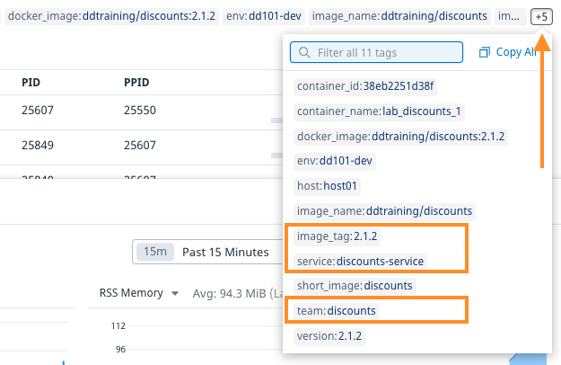

Next, you'll add labels to the the discounts service so the Agent will know how to tag individual services. Specifically, you'll set the tags `env`, `service`, and `version`, which enable Unified Service Tagging. You'll learn more about this when you work with APM and logs later in the course.

1. Open the file `docker-compose.yml`{{open}} in the IDE.

2. Add the the following labels to the `discounts` service by clicking on **Copy to Editor** in the following block of code:

  <pre class="file" data-filename="docker-compose.yml" data-target="insert" data-marker="# paste discounts labels here">
  labels:
         com.datadoghq.tags.env: 'dd101-dev'
         com.datadoghq.tags.service: 'discounts-service'
         com.datadoghq.tags.version: '2.1.2'
         my.custom.label.team: 'discounts'</pre>

  `com.datadoghq.tags.env: 'dd101-dev'` is technically unnecessary in this case because the Agent will set that by default for all services. But there are many use cases where a service would have a different `env` value than the Agent's default.

  The last label sets the custom tag `team:discounts`, as declared by `DD_DOCKER_LABELS_AS_TAGS` in the `agent` service.

3. Run `docker-compose down && docker-compose up -d`{{execute}} in the terminal to restart the application stack.

4. In the Datadog App, navigate to **Infrastructure > Containers**. If you see duplicate containers, sort by **STARTED (AGO)** to see the newest at the top. The others will go away shortly.

  Click on **lab_discounts_1**. Notice the new `service`, `team`, and `version` tags added under **ALL TAGS**. (You may have to click on the **+N** control at the end of the list to see them all, where **N** is a number.)

  

5. Navigate to the **Logs** page from the left-hand menu, filter by the `discounts-service` facet, and click on a log line. You'll see that new `discounts-service` log lines also have the new tags.

Click the **Continue** button to configure the remaining services.
