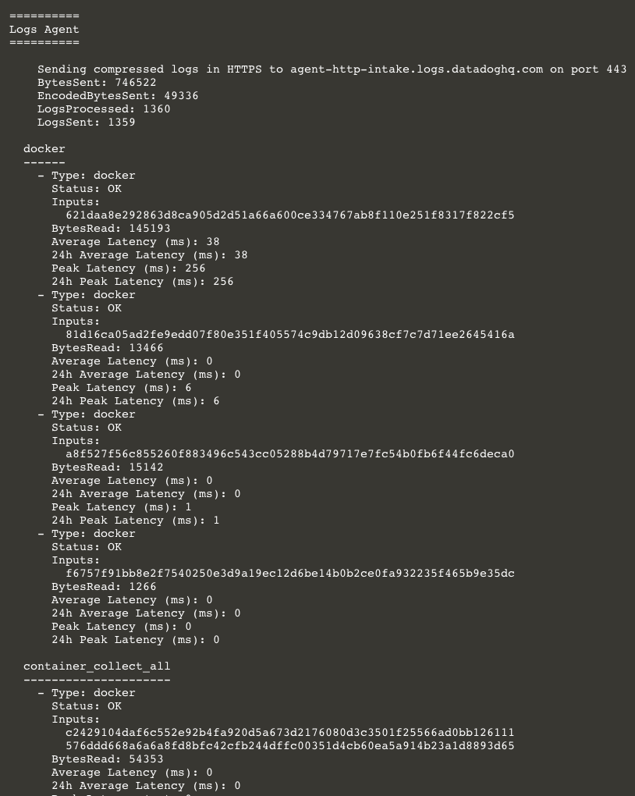

The remaining Storedog services run either Ruby or Python, both of which have Datadog integrations. However, unlike popular and well-defined applications such as PostgreSQL, Apache, Nginx, and others, Ruby and Python are processes that simply run applications. These applications might be your own, or frameworks such as Rails or Flask. It is up to the application developers to instrument these applications to talk to Datadog using Application Performance Monitoring (APM).

You'll learn more about APM later in this course. For now, you can enable the log pipeline features of the Ruby and Python integrations. This is achieved by adding a single label to each service in the `docker-compose.yml` file.

Start by adding an Autodiscovery label for the discounts service:

1. Open `docker-compose.yml`{{open}} in the IDE.

2. Add this line to the `discounts` service labels:

   <pre class="file" data-filename="docker-compose.yml" data-target="insert" data-marker="# discounts log label here">
   com.datadoghq.ad.logs: '[{"source": "python", "service": "discounts-service"}]'</pre>

   This label tells Datadog to parse logs from this service using the Python pipeline. It will also tag each log line with `service:discounts-service`.

3. Restart the stack in the terminal with `docker-compose down && docker-compose up -d`{{execute}}.

4. In the Datadog app, navigate to <a href="https://app.datadoghq.com/logs" target="_datadog">**Logs**</a> and wait for new log lines to appear.

5. Click on a `discounts-service` log line to view the details:

    

6. You can see that Datadog correctly identified the source by the Python logo in the upper-right corner. Also, the service is now correctly tagged as `discounts-service` rather than the default `discounts` taken from the container's `short_image` name.

    However, the logs are not getting parsed into structured JSON. Looking at <a href="https://app.datadoghq.com/logs/pipelines" target="_datadog">**Logs > Configuration**</a>, you'll see that the pipeline is indeed active. 

    The problem is that the discounts service doesn't write logs in a standard format. It's up to the application developer to emit logs that Datadog knows how to parse. There are ways around this that you'll learn about in the Logs and APM labs. The <a href="https://docs.datadoghq.com/logs/log_collection/python/?tab=jsonlogformatter" target="_blank">**Python integration documentation**</a> also provides a solution. 

Now you can add Autodiscovery labels to the other services:

1. In the lab IDE, add this to label the `advertisements` service:

    <pre class="file" data-filename="docker-compose.yml" data-target="insert" data-marker="# advertisements log label here">
   com.datadoghq.ad.logs: '[{"source": "python", "service": "advertisements-service"}]'</pre>

2. Add this to the `frontend` service:

    <pre class="file" data-filename="docker-compose.yml" data-target="insert" data-marker="# frontend log label here">
   com.datadoghq.ad.logs: '[{"source": "ruby", "service": "store-frontend"}]'</pre>
    
    Note that the `service` value is the same as each services `com.datadoghq.tags.service` label value.

3. In the terminal, restart the stack one more time with `docker-compose down && docker-compose up -d`{{execute}}.

4. Run `docker-compose exec datadog agent status`{{execute}}:

    Scroll up to the **Logs Agent** section and notice that each container you added the `com.datadoghq.ad.logs` label to has its own entry displaying its individual status and statistics. Previously, these containers had been grouped under **container_collect_all** with aggregated statistics.

    

    You can confirm this by comparing the value listed under `Inputs:` with the `CONTAINER ID` values displayed by `docker ps`{{execute}}.

5. In the Datadog app, look at the <a href="https://app.datadoghq.com/account/settings#integrations" target="_datadog">**Integrations**</a> page to see the newly installed Python and Ruby integrations.

6. Navigate to <a href="https://app.datadoghq.com/dashboard/lists" target="_datadog">**Dashboards**</a> and examine the new **Python Runtime Metrics** and **Ruby Runtime Metrics** dashboards. They're not graphing anything yet, but they will when you configure APM later in the course.

7. Navigate to <a href="https://app.datadoghq.com/logs" target="_datadog">**Logs Explorer**</a> and look at the latest `advertisements-service` and `store-frontend` log lines. Click on them to observe the details. The log lines are now correctly identified as Python and Ruby sources and tagged with the correct `service:` tags. 

As with the `discounts-service`, the Python and Ruby log pipelines are activated for these services, but the log output is not formatted uniformly. The `store-frontend` logs will look much better when you configure APM later in the course.

Click the **Continue** button to wrap up this lab.
