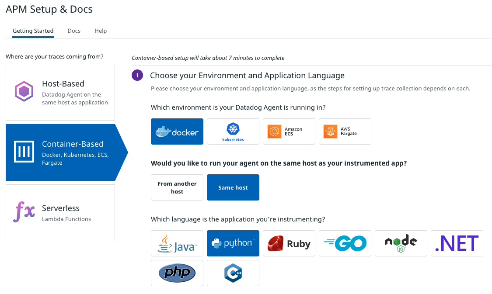
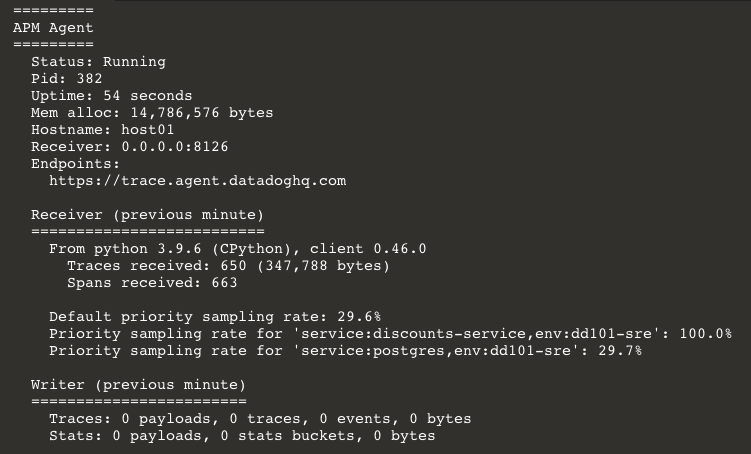

### About Tracing
Application traces are continuous streams of data about an application's execution. They can tell you the specific lines of code that ran, when they ran, and how long they took. 

When configured correctly, Datadog associates traces with everything it knows about your infrastructure. You can fluidly navigate across traces, logs, processes, metrics, and events to get a complete picture of what was happening at any point in time.

The Datadog Agent is automatically configured to accept traces. You need to instrument your applications to submit them to the Agent. This is done by adding a Datadog tracing library to your application. 

The Datadog application can walk you through enabling tracing for many languages in several environments:



1. In the Datadog App, navigate to the [APM Setup & Docs](https://app.datadoghq.com/apm/docs) page.

    > **Note:** You can also get to this page in the Datadog app by navigating to **APM > Setup & Configuration** in the menu bar, then selecting the **Service Setup** tab.

2. Click on **Container-Based**, then **Docker**, then **Same host**, then **Python**.

3. Take a moment to review the instructions on this page and you'll find there are three key components to setting up APM:

    * Enable trace collection in your environment by opening up port `8126` for the Datadog Agent to listen on.

    * Install the Datadog tracing library in your application.

    * Instrument your application to describe how your application sends traces to APM. This is often done as environment variables set on the container.

4. Next, open the IDE, and then open `docker-compose.yml`{{open}} to find that all of the services have been configured for you, starting with port `8126` opened on the `datadog` service.

    For this lab, you'll focus solely on the `discounts` service, but all of them should be configured.

5. Navigate further down the file to the `discounts` service. There you'll find environment variables in place to configure the tracing.

    ```
    - DD_SERVICE=discounts-service
    - DD_ENV=dd101-dev
    - DD_LOGS_INJECTION=true
    - DD_TRACE_SAMPLE_RATE=1
    - DD_PROFILING_ENABLED=true
    - DD_AGENT_HOST=datadog
    ```

    These values match the values you would set under **Step 4 - Instrument your application** in the Datadog application. They provide context for the Datadog tracing library installed into each of these services at the application level.
    
    The `DD_AGENT_HOST` tells the Datadog tracing library to send traces to the `datadog` service.

6. You'll also notice in this file that the command for running the `discounts` service includes `ddtrace-run`.

    This will instruct the application to begin tracing when it starts.

7. In the IDE, open `discounts-service/requirements.txt`{{open}}. These are the libraries that will be installed when the discounts service starts up.
    
    On line 4, you can see that `ddtrace==0.46.0` is already listed. Thanks to Storedog's forward-thinking developers, you don't need to do anything further with the application code.

8. Confirm that the `discounts-service`, `advertisements-service`, and `store-frontend` service are all sending traces to APM by running `docker-compose exec datadog agent status`{{execute}}

    Scroll to the **APM** section. It is now receiving Python and Ruby traces, with the details of each service in the **Receiver (previous minute)** sub-section:

    

Click the **Continue** button to see what is now available in the Datadog app.
