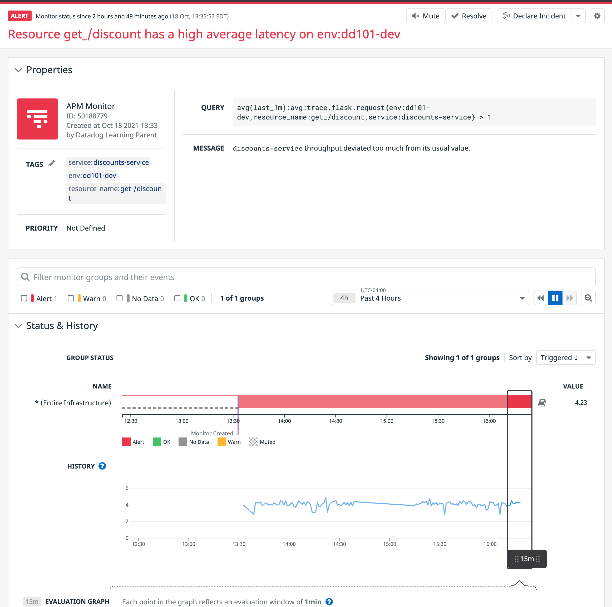
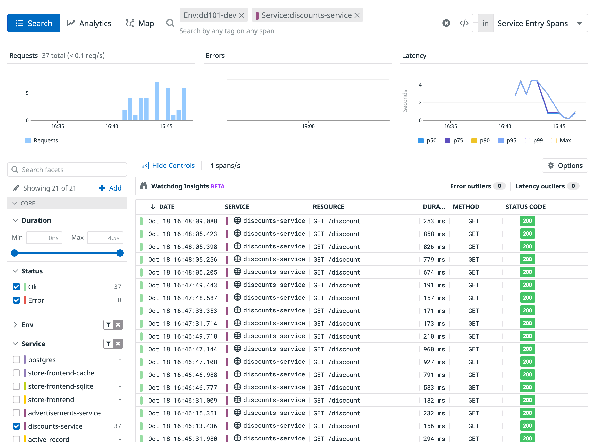
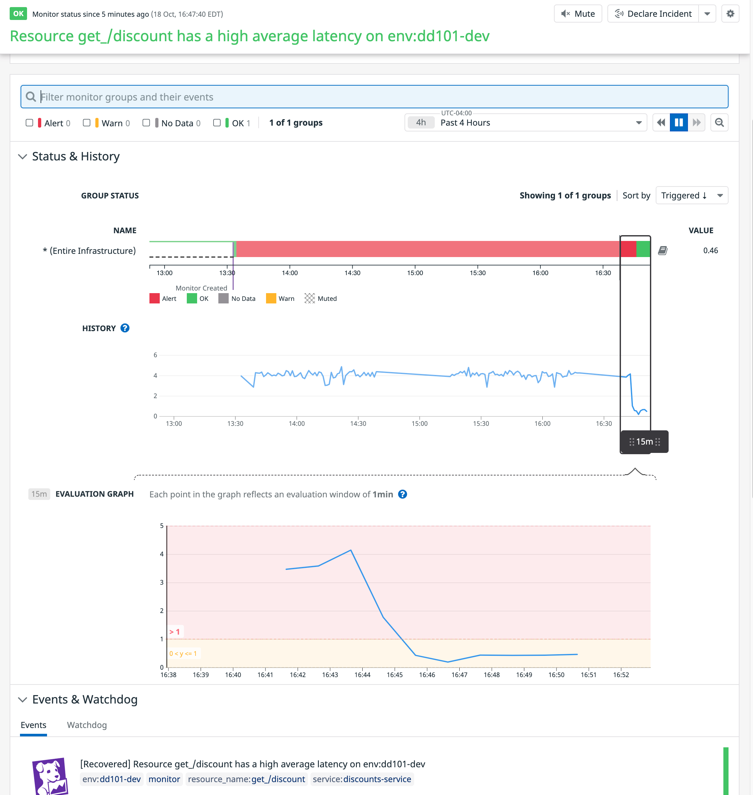

In the previous step, you noticed that there was an alert for the discounts service. This alert came from an APM monitor that was created by one of Storedog's SREs to alert you when the discounts service is experiencing performance issues, allowing you to quickly take action to fix the issue. 

In Datadog, monitors can be created to track any part of an application to detect changes in behavior or performance that you want to be alerted to. For example, you can create a monitor to track the number of requests to a specific endpoint over a period of time, or you can create a monitor to track the number of errors that occur on a specific endpoint.

## Check the monitor

1. Navigate to the <a href="https://app.datadoghq.com/monitors/manage" target="_datadog">**Monitors > Manage Monitors**</a> page in Datadog to see a list of monitors.

2. Click on the monitor with an **Alert** status to see what this monitor was set up to alert you to.

  

3. Here you'll find the query that was used to create the monitor, which is to check the average latency of the discounts service over the span of a minute. It is currently around four seconds, but the monitor is set to alert you if the latency is greater than one second.

4. Also notice how you can view a list of events around this monitor, so you know when it changes status. 

  This monitor is set to alert you when the `/discounts` resource is slow, so it's safe to assume that there is an issue in that service's code you should look at.

## Fix the latency issue

1. Open the **IDE** tab to the right, then open the `discounts-service/discounts.py`{{open}} file.

2. Around **line 35**, you'll find that a sleep command was previously left in the file by accident. 

  Remove that line, and the file will save automatically in the IDE and the changes will immediately take hold in the running container.

3. It will take a moment or two for the monitor to leave its **Alert** status and return to its **OK** status, so use this time to see if the latency is now less in the <a href="https://app.datadoghq.com/apm/traces?query=env%3Add101-dev" target="_datadog"> **APM > Traces**</a> page.

4. When you are at the page, you can use the left-hand facets column to filter by service. Do so by selecting the `discounts-service` option under **Services**.

5. Notice how the latency is now going down. The list of traces may show a difference, but you can also see it in the **Latency** graph towards the top of the page.

  

6. While you're here, take a moment and explore some of the other services that are also being monitored. 

  You'll find that even though the `store-frontend-sqlite` and `store-frontend-cache` services weren't explicitly configured for APM, they are set up within the `store-frontend` service, which we did configure for APM. 

7. After a moment or two, the monitor should now be in an **OK** status. Navigate to it and you should see something like this image:

  

Great work on using an APM monitor to quickly detect performance issues! Having the ability to see the performance of a service in your application is a great way to detect issues that may not be immediately apparent.

Click the **Continue** button below to learn about profiling.
