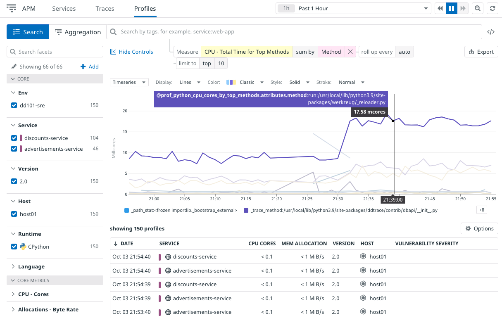
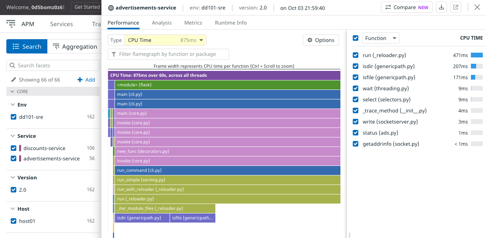

Datadog's Continuous Profiler gives you insight into the system resource consumption of your applications beyond traces. You can see CPU time, memory allocation, file I/O, garbage collection, network throughput, and more.

Datadog libraries support profiling for Go, Java, node, Python, and Ruby. You can learn more about configuring profiling for these languages in the [Profiling Documentation](https://docs.datadoghq.com/tracing/profiler/).

Profiling is enabled automatically for Storedog's Python services that send APM traces. Profiling for Ruby just came out of beta, and the store-frontend service has not yet enabled it.

Navigate to [APM > Profile Search](https://app.datadoghq.com/profiling/search) to see the `advertisements-service` and `discounts-service` profiling.

At the top is a graph of `CPU - Total Time for Top Methods`. Change **sum by** to `Service` to compare the two services.

Click on a profile from the list below the graph.

Mouse over the spans in the flame graph to see more information. 

In the dropdown to the right, change **Function** to **Package**.

As a developer, this is a valuable tool for finding ways to optimize applications by improving performance and potentially lowering resource costs.

Click the **Continue** button to wrap up this lab.
