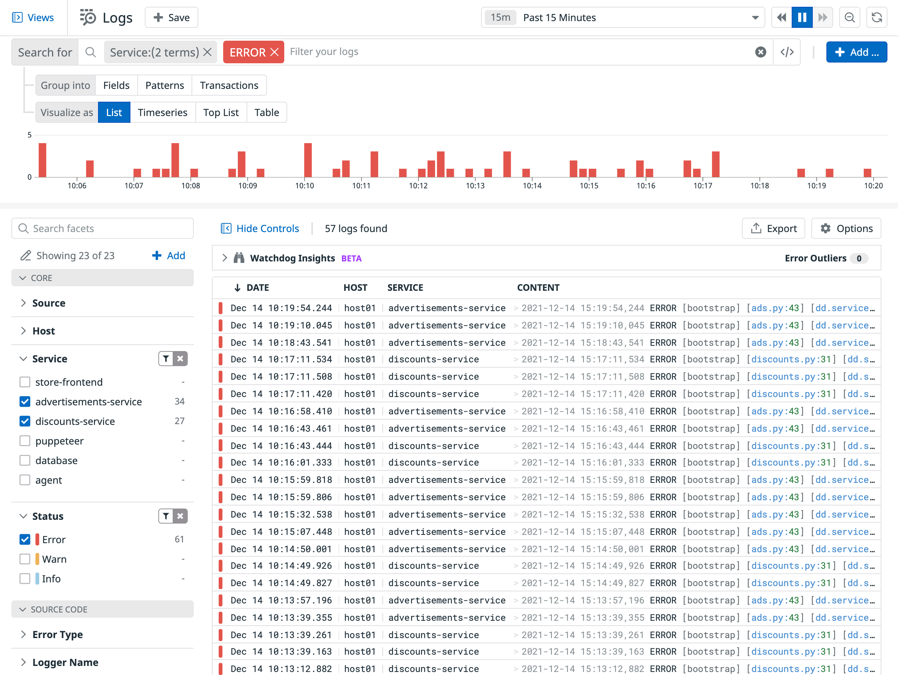
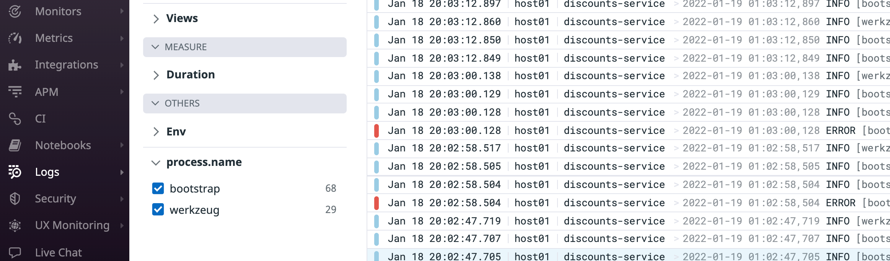

The Search view in <a href="https://docs.datadoghq.com/logs/explorer/" target="_datadog">Logs</a> is a log list that displays indexed logs matching a search context (i.e., a search query for a selected time range). 

1. Navigate to <a href="https://app.datadoghq.com/logs" target="_datadog">**Logs**</a>.

2. You can use the search field and the Facets list, which is located to the left of the logs list, to create a search query to filter the log list. 

    A search query can include assigned tags like `env` and `service`, attributes extracted from the logs like `@http.status_code`, and text strings from log messages. Search queries built in the search field require proper <a href="https://docs.datadoghq.com/logs/search_syntax/" target="_blank">search syntax</a>.

    In the Facets list on the left, select `advertisements-service` and `discounts-service` under **Service** and `Error` under **Status** to filter logs just for these services. 

    

3. Find an error log that starts with `ERROR` and click it. 

    The <a href="https://docs.datadoghq.com/logs/explorer/#the-log-side-panel" target="_blank">Log Side Panel</a> opens with the log details including assigned tags, the log message, any extracted attributes, related traces, and related infrastructure metrics.

    

4. In this detailed log panel, click the **Traces** tab to view the associated trace. Click the **Metrics** tab to view the associated infrastructure metric.
    
    Notice the log message. Instead of using the `ERROR` status, use the log message to filter error logs for these services. 
    
5. Copy the part of the log message that reads `An error occurred`, and close the log side panel.

6. In the search field, click the "X" for `ERROR` to delete it. Paste the log message text `"An error occurred"`{{copy}} in the search field and press "Enter". Notice the same list of logs appears. 

7. Delete the `An error occurred` text from the search field and press "Enter". Select `Error` under the **Status** facet again.

8. Common tags and attributes appear in the <a href="https://docs.datadoghq.com/logs/explorer/facets/" target="_blank">Facets</a> list on the left of the log list automatically. You can add or edit a tag or attribute to the Facets panel from the log details in the log side panel.

    

9. Click one of the logs that contains `ERROR [bootstrap]` to open the log side panel. Scroll down to view the list of **Event Attributes**.

10. Next to `name` under `process`, click the **gear icon** that appears. Select **Create facet for @process.name**. 
    
11. The **Add facet** window will appear. You can expand **Advanced** to view the additional fields. Click **Add**. 
    
    You'll see a message confirming that the facet has been successfully added. Close the logs side panel. 

12. Scroll to the bottom of the Facets list. Under the **OTHERS** facet group, expand the **process.name** facet. You may need to wait for new logs to be collected and processed. Then, you'll see the values of this attribute that are found in a new filtered set of the logs.

    

    It’s important to remember that the tags and attributes available to you for creating search contexts depends on the tags you assign to the logs and the attributes you extract from the logs. 

Now that you've gone over log search and querying, it's time to look at the different aggregation features for analyzing logs.

