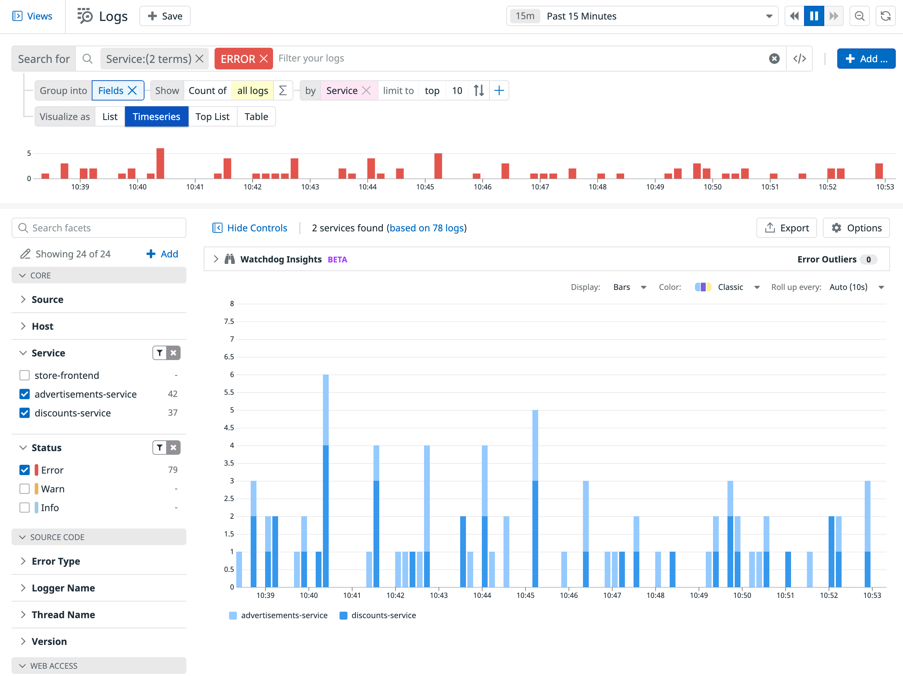

With the <a href="https://docs.datadoghq.com/logs/explorer/#fields" target="_blank">Fields</a> aggregation option, which is located right underneath the log query filter at the top of the page, all logs matching the query filter are aggregated into groups based on the value of a log facet. For these groups, you can extract counts of logs per group, unique counts of coded values for a facet per group, and statistical operations on numerical values of a facet per group.

1. In <a href="https://app.datadoghq.com/logs" target="_datadog">**Logs**</a>, filter the list to the `service:advertisements-service`, `service:discounts-service`, and `status:error`.

2. Select `Fields` for **Group into** below the search field. A graph visualization of the filtered logs will replace the log list.  

    Group the fields by service so that it reads **Group into** `Fields` and **Show Count of** `all logs` **by** `Service`.

    Above the graph, you'll see that **Timeseries** is selected, which gives you a timeline of total errors broken out by service. Select **Toplist** next to **Timeseries**, then select **Table** to view the different visualizations. In this case, you'll see the total number of errors per service in a set period of time, whereas the **Timeseries** view gives you a more granular breakdown of when the errors occurred during that time period.

    Click **Timeseries** again.

    

3. Click **Export** above the graph. You can export the visualization areas of the product, such as a Logs Monitor, to a dashboard, and to generate a log-based metric (<a href="https://docs.datadoghq.com/logs/logs_to_metrics/" target="_blank">Generate Metrics</a>). Click **Export** again to close the menu.

4. Click **Save** above the search field to save this view.

    Enter `Ads_Discounts_Errors_Timeseries`{{copy}} as the name of the **New View** and click **Save**. The new view will appear in the list.

    Spend a moment or two exploring the options you just learned, then return to this view by selecting it from the list. When you do, you'll notice the URL parameters and search criteria change to reflect the new view, meaning you can share it with others.

5. Click the "X" next to **Fields** to return to the log list, then click the **Continue** button to learn how to search by patterns.
