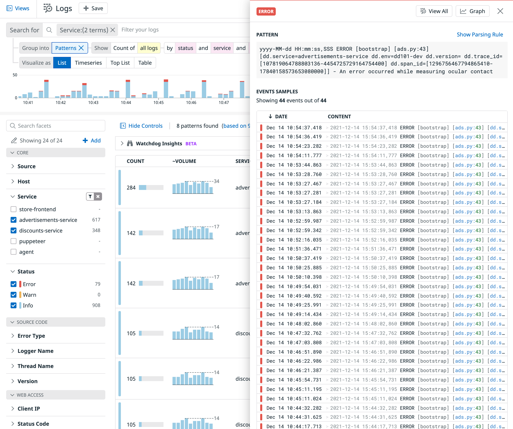
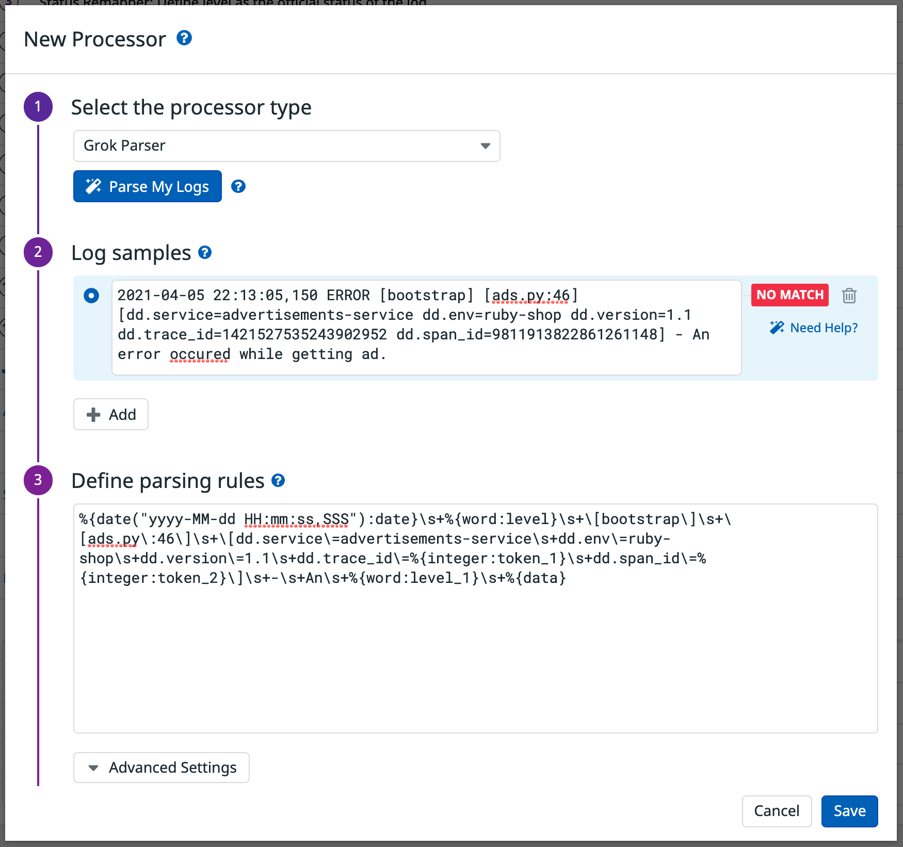

Organizing large volumes of logs from different sources can be cumbersome. However, logs from a source usually have specific patterns. The <a href="https://docs.datadoghq.com/logs/explorer/#patterns" target="_blank">Patterns</a> aggregation can be surfaced automatically in the Log Explorer and are listed by number of logs with a service name, log status, and log message that matches a certain pattern. 

You can filter the list using search syntax and facets to focus on patterns you’re interested in. You can also click a pattern from the list to view log samples matching the pattern and even the pattern’s parsing rule. 

With pattern aggregation, logs that have a message with similar structures, belong to the same service, and have the same status are grouped together. The patterns view is helpful for detecting and filtering noisy error patterns that could cause you to miss other issues.

1. In <a href="https://app.datadoghq.com/logs" target="_datadog">**Logs**</a>, filter the list to the `service:advertisements-service` and `service:discounts-service`.

2. Select `Patterns` for **Group in** below the search field.

    Observe the differences in the patterns that are listed.

3. Click one of the patterns to open the details side panel. The pattern and a list of "Events Samples" are displayed.

    

    In the upper-right above the Pattern, click **Show Parsing Rule**. This allows you to see how the logs were parsed and if there are any optimizations you'd like to make by building a custom <a href="https://docs.datadoghq.com/logs/explorer/#patterns" target="_datadog">pipeline</a> for this service/source. 

    

    Close the side panel.

    > **Note**: To learn more about creating custom pipelines, check out the [Going Deeper with Logs: Processing](https://learn.datadoghq.com/course/view.php?id=36) course in the Learning Center.

5. Click the "X" next to **Patterns** to return to the log list, then click the **Continue** button to go to the next step.
