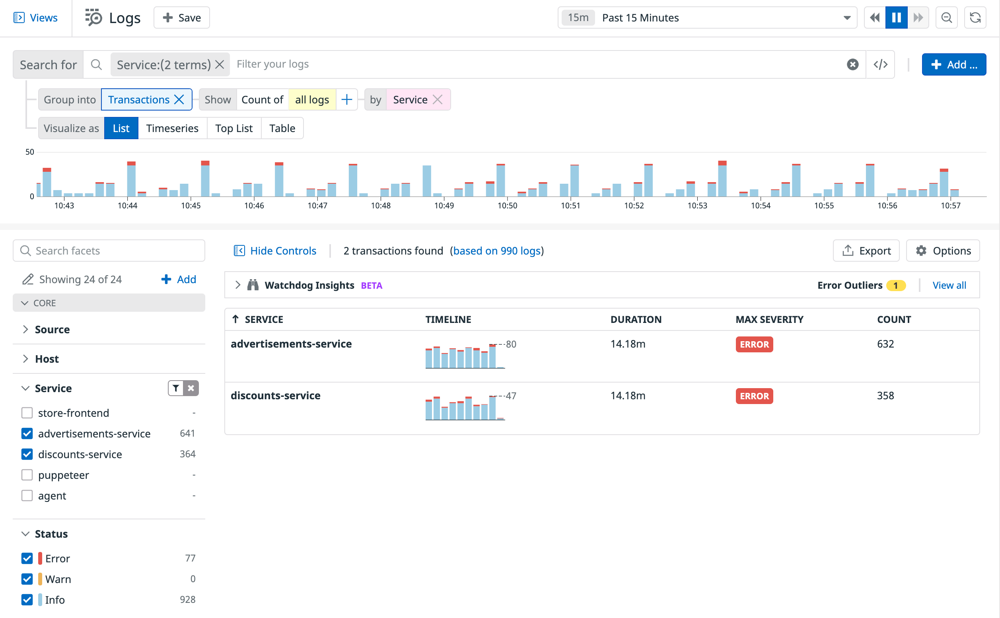

<a href="https://docs.datadoghq.com/logs/explorer/group/#transactions" target="_blank">Transaction</a> queries allow you to aggregate related log events into a single higher-level “transaction” event using a tag or an attribute from the logs. 

For each transaction event, the tag or attribute value and corresponding transaction duration, max severity, and event count are displayed. 

With transaction queries, you can visualize complex interconnected systems through log events, identify transaction bottlenecks by comparing durations, event counts, and custom measures, and reduce mean time to detect (MTTD) by isolating transactions with errors or high latencies.

Transactions aggregate indexed logs according to instances of a sequence of events, such as a user session or a request processed across multiple microservices. 

1. In <a href="https://app.datadoghq.com/logs" target="_datadog">**Logs**</a>, filter the list to the `service:advertisements-service`, `service:discounts-service`.

2. Select `Transactions` for **Group into** below the search field.

    Group the transactions by service so that it reads **Group into** `Transactions` and **Show Count of** `all logs` **by** `Service`.

    The Transactions list will display each service along with the the total count of logs, the total duration of the transactions, and the maximum severity of the logs. This gives you the ability to quickly see which services are performing better when it comes to communicating with other services and which ones you should pay more attention to.

    

3. Clear the search field above the log list and enter `service:store-frontend`{{copy}}.

    **Group into** `Transactions` and **Show count of** `URL path` **by** `Status`.

    The Transactions list will display each status along with the total count of logs.

    

4. Click the "X" next to the **Group into** field to return to the log list.

Click the **Continue** button to wrap up this lab.
