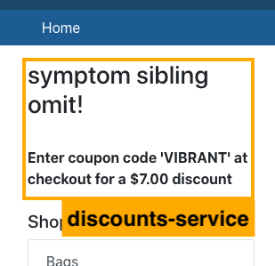
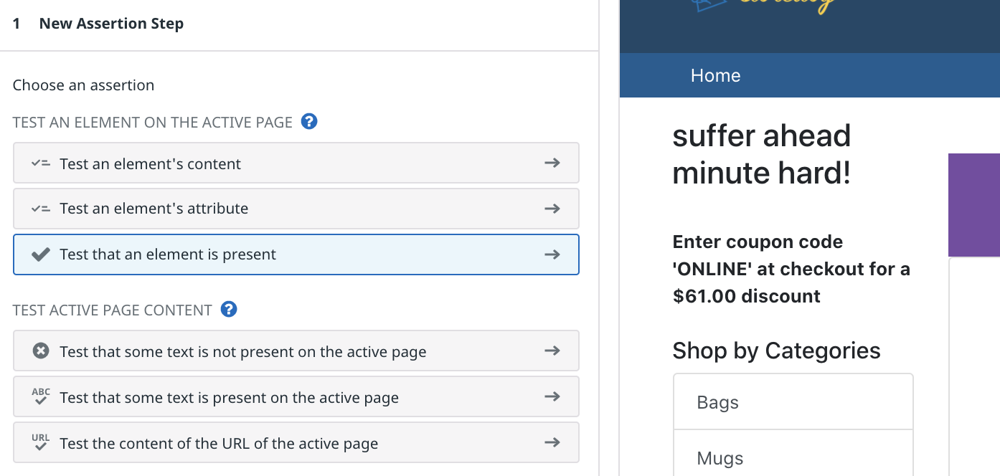
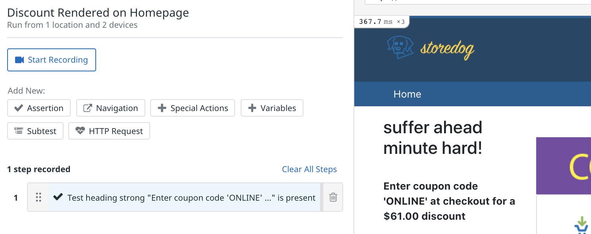

To start, you'll employ a synthetic browser test that will monitor Storedog's frontend and ensure a good user experience. 

Throughout this course, you may have seen how the Storedog frontend displays the response from the discounts service in the upper-left corner of the home page as a "coupon block":

While API tests make assertions about the raw content of HTTP responses, browser tests make assertions about a web page's Document Object Model (DOM) as rendered by a browser.

You can also record user actions to change the state of the page, such as clicking on buttons, hovering, and navigating to new pages.

> **Note:** To create and edit browser tests, you must use Google Chrome and be able to install an extension from the Chrome Web Store. You may return to your preferred browser after you have created browser tests. The Datadog app will prompt you to install the extension.

## Create a simple browser test

In the <a href="https://app.datadoghq.com" target="_datadog">Datadog App</a>, navigate to **UX Monitoring > New Test** and click on **New Browser Test**. Browser tests are configured in two parts. First, you configure the details common to synthetic tests. Then, you will record the specific actions the test should perform on the web application to satisfy assertions.

### Test details

1. For **Starting URL**, enter `https://[[HOST_SUBDOMAIN]]-3000-[[KATACODA_HOST]].environments.katacoda.com/`{{copy}}.

2. For **Name**, enter something like `Discount Rendered on Homepage`{{copy}}.

3. Under **Browsers & Devices**, leave the defaults. These parameters are unique to browser tests and you should tailor them to suit your web application's typical visitor. Note that each selection will result in a separate test result.

4. Under **Locations**, choose one or two regions from which to run the test. 

5. Under **Specify test frequency**, select **7d**. You will also trigger this test on demand in this lab.

6. You can leave the defaults for **Define alert conditions** and **Notify your team**.

7. Click **Save Details & Record Test** to move to the next step.

### Install the test recorder extension

If you have already installed the Datadog test recorder extension, skip down to Edit the Browser Test. If not, you will see "Add our Chrome extension" and a **Add the Extension** button. 

1. Click the **Add the Extension** button to open the Chrome Web Store. 

2. On the **Datadog test recorder** page, click the **Add to Chrome** button.

3. Chrome will prompt you to confirm the installation. Click **Add extension**.

4. You will see a dialog pop-up at the top of Chrome confirming that the extension is installed. It will say "Use this extension by clicking on this icon", but that is not necessary; the Datadog app will activate it when necessary.

5. Click Chrome's **Back** button to return to the Edit Browser Test page.

### Edit the browser test

You will now record a test to make the following assertion: **the coupon code block is displayed on the home page.**

> **Note:** There is a **Start Recording** button at the top of the left-hand pane. This is useful if the assertions you make require user interaction to alter the page state, such as typing into a form or navigating to another page. 
>
> In this lab, we will only make assertions based on the state of the homepage when it first loads without any user interaction.

1. Under **Add New**, click **Assertion**.

2. Click **Test that an element is present**. 

  

3. Hover over the coupon block content under the heading. It is the text that begins, "Enter the coupon code..." 

  You will see a dashed outline surrounding the DOM element that Datadog detects. Move your cursor around to see what other elements Datadog detects.

4. Click on the coupon block content. You will see a new assertion appear on the left:

  

5. Click on the new assertion. Note that you can update **Step Name** and configure **Advanced Options**. 

6. Change **Step Name** to `Coupon Block Content Present`{{copy}}, and then click **Apply**.

7. This is a good start. Click **Save & Launch Test**, which will automatically launch the test for you.

Click **Continue** to move onto the next step, where you'll learn about how to read the results of the test.
