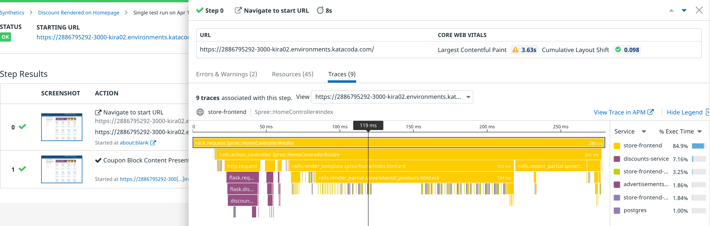

### View test results

After a few seconds you should have test results to observe:

1. Scroll down to the **Test Results** section and click the **Refresh** button to see the results. You should see a result for every browser, device, and location you configured. Click on one to view the test result details.

1. Click on the first result. You will see a line for each step in your browser test, with Step 0 always being "Navigate to start URL":
  
  

  Each step will have a screenshot of what Datadog saw when it executed the step, along with metrics and logs related to the step.

2. Click on the **Error** indicator in Step 0. This will display a panel similar to a web browser's developer tools:

  

  You will see any errors, warnings, or messages that a web application logs to a browser's console. 
  
  > **Note:** In Step 0, you will see Console errors—you can ignore these.

3. Click on the **Resources** tab or close the panel and click on the **Resources** indicator in the Step 0 results. This displays all of the resources that the browser downloaded to render the page:
  
  
  
  You can search resources or filter them by toggling by type to the right of the search field.

4. Click on the **Traces** tab to see the APM traces collected during this step. You will see "No traces associated with this step." 

  Datadog does not automatically associate APM traces with browser test results. You must specify the URLs for which Datadog should add the [necessary headers](https://docs.datadoghq.com/synthetics/apm/#how-are-traces-linked-to-tests).

### Configure APM for browser tests

1. Navigate to **UX Monitoring > Settings** and click on the **Default Settings** tab.
  
2. Under **APM integration for Browser Tests**, add the following wildcard URL for Storedog running in your lab environment. The exact URL will change if your session expires, if you refresh your browser, or when you start the second part of this course. This wildcard should continue to work in all cases:

  `https://*.environments.katacoda.com/*`{{ copy }}.

  Once entered, click the **Save Integration Settings** button.

  

3. Return to the browser test page by navigating to **UX Monitoring** > **Synthetic Tests** and clicking on the test in the center of the page. Next, click **Run Test Now** at the top of the page to get results including APM traces.
  
  When APM traces for browser tests are configured, you will see a **Traces** indicator in the first **Step Results** row.

  
  
  Clicking the **Traces** indicator will display a flame graph for all APM-enabled services that did some work in this step of the browser test:
  
  

  You can click the **View Trace in APM** link to dig deeper into the traces. See the Datadog Documentation to learn more about [APM traces in synthetic tests](https://docs.datadoghq.com/synthetics/apm).

Now that you have a basic browser test set up for the coupon block, think about how you can expand upon it to other features of the site.

Click the **Continue** button to conclude this lab.
