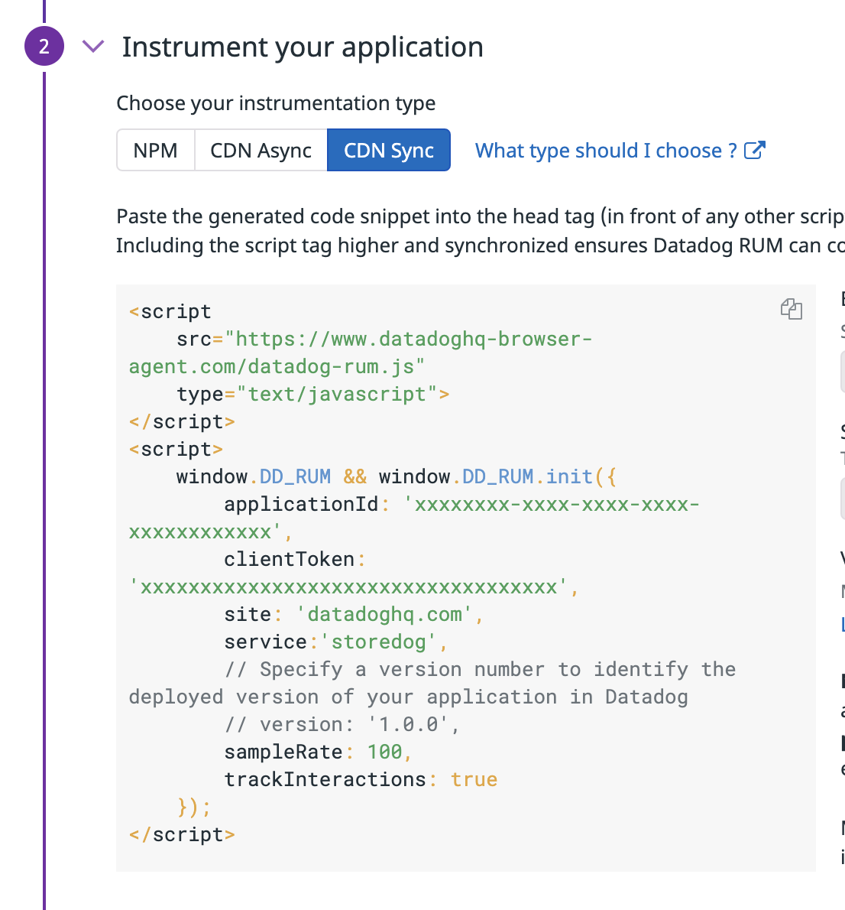
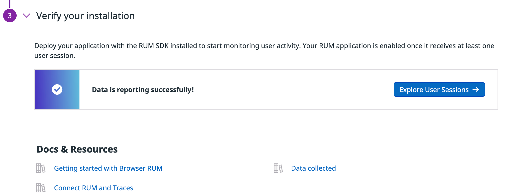

This lab uses Docker to run a demo ecommerce website called "Storedog".

1. To get started with Datadog RUM, we need to set up a RUM application. First, navigate to the [RUM Applications](https://app.datadoghq.com/rum/list) section of your Datadog account. This is found under **UX Monitoring** > **Real User Monitoring** in the Datadog sidebar.

2. Click the **+ New Application** button.

3. You will see options for integrating with different application types. We are integrating on the web using JavaScript, so ensure that **JS** is selected.

4. Enter a name for the application. You can use `Storedog` or whatever you prefer for your site.

5. Click the **Create New RUM Application** button.

6. If you are using Network Performance Monitoring (NPM) to manage dependencies for your project's frontend, you can integrate RUM using the `@datadog/browser-rum` package. However, here we are just going to add the JavaScript inline, so select the `CDN Sync` tab:
  
  

7. Back in the lab platform, open the `IDE` tab (it may take a few seconds to load) to navigate to our frontend code. Within the IDE, open the file located at `store-frontend/app/views/spree/layouts/spree_application.html.erb`{{open}}. You can click to load this file if the IDE is already displayed. 

  This Ruby file is the main template for our application. By integrating the RUM script here, it will be available throughout our application.

  Notice the variable placeholders such as `<%= ENV['DD_CLIENT_TOKEN'] %>`. When this template is rendered, these will be replaced by the corresponding environment variables set in the `frontend` service's container. In this lab, they will be inherited from the host environment via Docker Compose.

8. You'll see that we have already integrated the RUM script in the frontend and set the initialization arguments (the code block starts with `window.DD_RUM &&`). 

  You'll also notice that after initialization, the `startSessionReplayRecording()` method is called. This will allow you to use **Session Replay** and play back the steps a user took during their session.

9. In this lab, we need to set the `applicationId` and `clientToken` values using environment variables that Docker Compose will pass on to the `frontend` service:
  
  1. Copy the `applicationId` from the RUM page and assign it to `DD_APPLICATION_ID` in the terminal like: `export DD_APPLICATION_ID=xxxxxxxxxxxxxxxxxxxxxxxxxxxxxxxxxxx`
  
  2. Copy the `clientToken` from the RUM page and assign it to `DD_CLIENT_TOKEN` in the terminal like: `export DD_CLIENT_TOKEN=xxxxxxxxxxxxxxxxxxxxxxxxxxxxxxxxxxx`

10. To verify, when you run this command, you should see *YOUR* keys displayed in the terminal: `echo $DD_CLIENT_TOKEN $DD_APPLICATION_ID`{{execute}}

11. Start the Storedog app using `docker-compose up -d`{{execute}}. Docker will pick up the environment variables you set in the host and pass them along to the containers. You should see the app starting.

12. Click on the **Storedog** tab to the right to open the site, then click around to generate some user session data.

  > **Note:** There is also a puppeteer service running to simulate user sessions as well. This way there's more data coming in.

13. Now navigate back to the RUM Application page in Datadog. After a few moments of gathering data, the section under **Verify your installation** should have a button titled **Explore User Sessions**, resembling this image: 

  

14. Click that button and you will be taken to the RUM Explorer page, where user session data is displayed. It may take a few moments for more data to come in. Explore this page for a moment or two, as you'll use it soon to drill further into a user's session.

Now that the application is up and running with RUM, this is a good time to explore the different tools at your disposal for monitoring your application.

Click **Continue** below.
