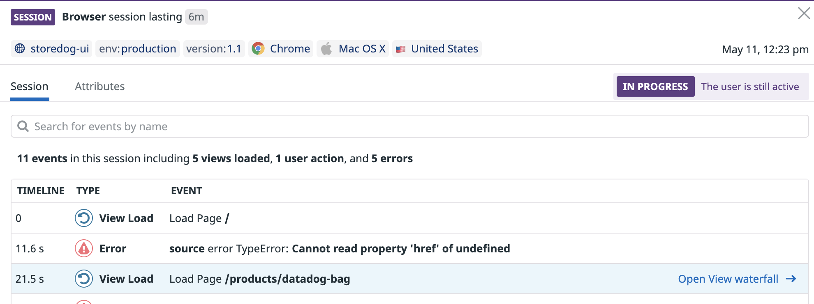

One of the major benefits that Datadog RUM offers is the ability to dive into granular data.

1. First, navigate to the main **Sessions** tab. Next, click into one of the user sessions, and in the events table, click on a **View Load** event:

  

2. By looking into this single view, you can see performance, resources, errors, and user actions associated with this page load. This data can be provided to the responsible engineers to help debug and rectify issues for your users. By sharing the URL from the browser on your view, an engineer will be brought to the same panel you are looking at so there is no discrepancy in information.

3. Click on one of the user actions from the list. You'll find a detailed view of how that action performed, any logs associated with it, what resources it used, and any errors that occurred because of the action.

4. Notice the button that says **Replay Session** at the top right of the panel? Click on it and you'll be shown a video of that user's session. 

  The `startSessionReplayRecording()` function from earlier is what allows you to play back how a user interacted with your site to determine what led to an error or performance issue. 

Click **Continue** below.
