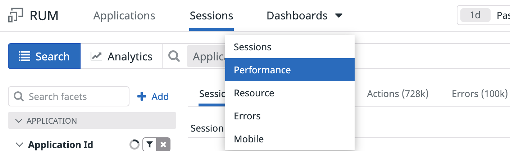

1. You can now close the page load and user session panels. You should have a view of your application with a **Dashboards** dropdown at the top If you closed the page for your RUM application or don't see that dropdown, you can open your application again from the [RUM Application List](https://app.datadoghq.com/rum/list).

2. By clicking on the **Dashboards** dropdown, you can view the dashboards Datadog automatically creates for RUM Applications:

  

3. Take a look at the **Performance** dashboard. The performance overview dashboard offers a bird’s-eye view of RUM applications. It is separated into several sections:

  * **Overview:** This contains the number of overall page views in this time span and some top-level metrics on load time.

  * **Core Web Vitals:** Gives you an overview of load performance, interactivity, and visual stability.
   
  * **Most Viewed Pages:** Shows the same metrics from the previous sections, but organized by page path.
   
  * **Long tasks analysis:** Shows what long thread blocking tasks users are experiencing.
   
  * **XHR and Fetch analysis:** Provides insight into what API requests are being used and their performance.
   
  * **Resources analysis:** Shows the resources loaded grouped by type (e.g., JS, CSS, etc).

4. If you go back to your [RUM Application List](https://app.datadoghq.com/rum/list), you can also check out the **Sessions**, **Resource**, and **Errors** dashboards to view more details for those.

  You can easily access these by hovering the **Dashboards** on the left-hand navigation and entering `RUM` in the search field provided.

Click the **Continue** button to conclude this lab.
