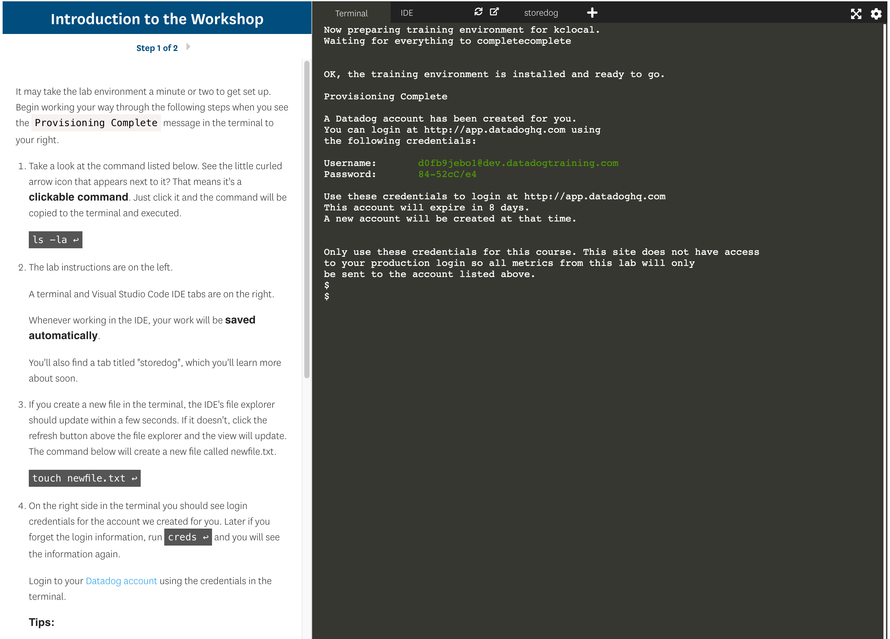

# Getting Started with the Lab Environment

Throughout this course, you'll learn how to use Datadog through interactive lab exercises. All of these exercises are ran in the browser, so there is no need to install any software or run any virtual machines on your personal computer. For the best results, however, it's recommended that you use Google Chrome or Firefox as your browser.

Each lab begins with an introduction page that informs you of what you will learn in the lab. The lab's instructional pages look something like the following image:

 

On the left-hand side of the page, you'll find the instructions for the lab. On the right, you'll find an interactive terminal along with tabs to open other tools, such as an IDE and the application you'll be using to learn about Datadog's features.

When each lab begins, it has to run a few scripts in the background to ensure you are set up correctly in the environment. These scripts install tools needed for the lab environment and the application you'll be using to learn about Datadog's features. 

More importantly, these scripts will provision a training account for Datadog, which you'll use to take the lab exercises. This way you won't need your own personal or organizational account associated with your learning. 

You'll learn more about how all of this works in the first lab coming up next!
