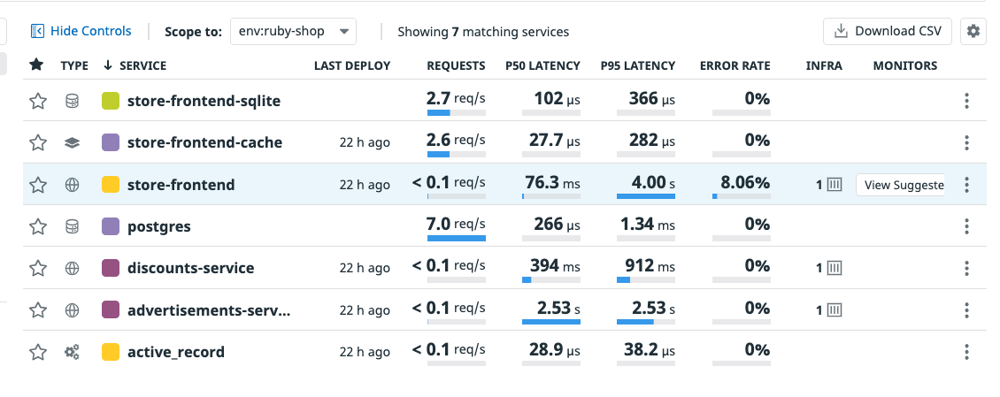
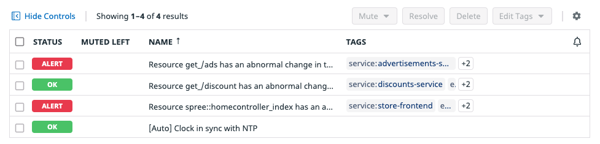

In Datadog, you can create a variety of <a href="https://docs.datadoghq.com/monitors/" target="_datadog">**Monitors**</a> to track the health of your applications and to alert you if action is needed. 

Creating monitors to track the latency of specific `store-frontend` and `advertisements-service` resources helps to keep an eye on things, even when you can't be staring at traces and logs. You will use these monitors later in the activity.

#### Store-frontend Service

1. In the <a href="https://app.datadoghq.com/apm/services?env=intro-apm" target="_datadog">**Service List**</a>, click on **store-frontend** to see a more detailed overview of the service. 

    

2. Scroll to the **Endpoints** list and click **Spree::HomeController#index**.

3. Click the **No Monitors or Synthetics Tests** banner near the top and click **New Resource Monitor**. You will be redirected to a new APM monitor page.

4. Based on the Service and Endpoint from which you began creating a Resource Monitor, the **Select monitor scope** section is already filled out with the relevant information.

5. Expand **Set alert conditions**, select **Threshold Alert**. 

    1. Set the alert as follows: **Alert when `Avg latency` is above the threshold over the last `1 minute`**. To change it to `1 minute`, click the `5 minute` dropdown and set it to `custom`.

6. Set the **Alert Threshold** to `1`. Leave the setting of **Never** auto resolving from an alerted state.

7. Under **Notify your team**, delete `@yourloginemail` from the dropdown. You will notice that `@yourloginemail` is automatically deleted from the message in step 4. You can easily add or remove team members from the notifications and messages this way. In this case, you do not want to send any notifications.

8. Expand **Say what's happening**, here you can use `@` to tag team members , or use variables like `#is_alert` to format your message. For the purposes of this activity, leave the message as is.

9. Click **Create** on the bottom right. 

    1. You will be redirected to the new monitor page. Browse the details. 
    
    2. Notice that **Tags** for the resource, service, and environment were automatically assigned to the monitor. These tags will correlate the monitor to the respective Service Page and Resource Page.

Now, go ahead and create some monitors for the downstream services you instrumented previously.

#### Discounts Service

1. Continuing from step 9 above, navigate to <a href="https://app.datadoghq.com/monitors/create" target="_datadog">**Monitors** > **New Monitor**</a>

2. Select **APM Metrics** from the list of monitor types.

3. Under **Select monitor scope**, select **APM Metrics**.

4. Select `discounts-service` as the **Service** and `get_/discount` as the **Resource**.

5. Repeat steps 5 - 8 from above.

#### Advertisements Service

Finally, setup a monitor for the `advertisements-service`. 

1. Navigate back to <a href="https://app.datadoghq.com/monitors/create" target="_datadog">**Monitors** > **New Monitor**</a>

2. Select **APM** from the list of monitor types.

3. Under Select monitor scope, select **APM Metrics**.

    1. Then, select `advertisements-service` for the **Service** and select `get_/ads` as the **Resource**.

4. Repeat steps 5 - 8 from above.

You can view the monitors on the <a href="https://app.datadoghq.com/monitors/manage" target="_datadog">**Monitor** > **Manage Monitors**</a> page, you may initially notice that they have a status of `No Data`. Because the monitors are new, it may take a few minutes for the status of the monitors to update as data continues to flow into the platform. After waiting, you may begin to see some monitor data populating the Monitor list.

