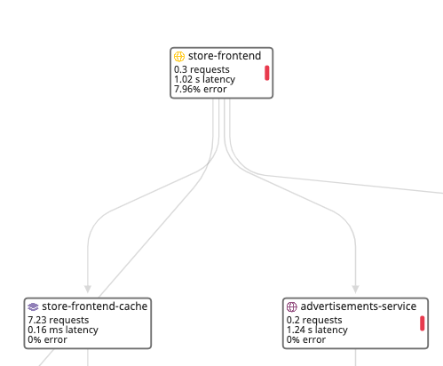

The monitors you created should have gathered some data. Because the monitors are linked to the related services and resources, you can see the status of the monitors in the Service Map. If any monitors are in the `ALERT` status, you can start investigating the service from the Service Map.

1. Navigate to <a href="https://app.datadoghq.com/apm/map" target="_datadog">**APM** > **Service Map**</a>. 

    The red lines on the nodes of the `store-frontend` and `advertisements-services` indicate that the monitor that you created for each service endpoint is in the `ALERT` status. 

    

2. Click the **store-frontend** node, then click **Inspect**. 

    Because the `discounts-service` and `advertisements-service` are downstream, the red **advertisements-service** node status provides a good starting place for investigation.

Turn your attention to the `advertisements-service`.

## Investigate Advertisements

1. Go back to the `Service Map` browser tab where you were inspecting the `store-frontend`.

2. First, click **advertisements-service**. The monitor banner at the top of the page is showing the monitor is in an `ALERT` status, which is a threshold that had been set at latencies over 1 second. As previously identified, this service has a consistently high latency for this service,

3. Scroll down and click the **Get /ads** endpoint. This is the endpoint you created the monitor for earlier. 

    Notice the **AVG LATENCY** for this endpoint is ~2.5 seconds. *The **Get /ads** endpoint has a very steadily high latency, thats a problem*.

4. Go back to the Service Map browser tab where you were inspecting the `store-frontend`.

5. Click the **store-frontend** node, then click **View service overview**. 

6. Scroll to the **Endpoints** list and sort the list by **AVG LATENCY**. 

    Note: If the **AVG LATENCY** column is not displayed, click the **Options** icon next to the **Search Endpoints** field and select **AVG LANTECY**. 
    
    Notice that the `Spree::HomeController#index` and `Spree::ProductsController#show` have latencies more than 2.5 seconds. 

7. For each endpoint listed in step 15, click the endpoint to view its page. 

    1. Scroll to the **Span Summary** and sort by **AVG DURATION**. 
    
    2. Scroll to the **Traces** list. Click any of the traces to view the details. 
    
    3. Notice from the **Span Summary** and **Traces** that the endpoint is dependent on the `advertisements-service`. 
    
    4. For the `Spree::HomeController#index` endpoint, notice the monitor you created is in the alert status. (Note: To save time, you didn't create monitors for the other endpoints. You can always create monitors for the other two endpoints to see how they are affected by fixing the app.) 
    
    *This investigation shows something is definitely wrong with the service, you should go to the code.*

8. Head back over to the IDE tab and open the `ads.py`{{open}} file to view the code.

9. Browse the file. You may notice that two sleep commands are in the codebase, and they appear to be leftovers from some testing. Remove these sleeps by deleting **Lines 43-44** and **Lines 66-67**.

The removal of the erroneously left test code should also remedy the high latencies in the `store-frontend` endpoints.