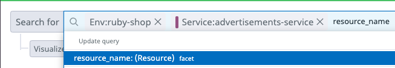

With your fixes implemented, analyze how the changes you made affected that services performance.

1. Navigate to <a href="https://app.datadoghq.com/apm/traces?query=env%3Aintro-apm" target="_datadog">**APM** > **Traces**</a>. 

2. In the left hand side Facet search, click the `advertisements-service` to view only traces coming from that service. This includes two endpoints, one of which you didn't change. You can write a more targeted search.

3. In the search at the top, enter `resource_name`, before hitting enter click on `resource_name:Resource facet`. 

    .

4. Next, choose the `GET /ads` resource. This will ensure you are only viewing traces from the `advertisements-service`, and specifically from the `GET /ads` endpoint. 

    The final search parameter should be to define the `duration` you want to view, to ensure the latency from that endpoint is fixed. Ideally, the `2.5s` traces should be gone.

5. In the trace search, enter `@duration:>2.45s` to view traces only taking longer than `2.45 seconds`. There you have it, no new traces coming in at a duration of 2.5 seconds. 

    As another test, remove the current `duration` filter, search again, and you should see new traces coming in with more reasonable duration. Trace Search is a great way to filter your traces to quickly get the information you need.

It would also be a good idea to confirm that the upstream services are now running properly after the fix.

1. Navigate back to the <a href="https://app.datadoghq.com/apm/services?env=intro-apm" target="_datadog">**APM** > **Services**</a> page and enter the `store-frontend` service. 

1. Looking at the provided `Latency` graph, you will also see a reduction in overall latency for this service. To get better view, you can click and drag over the area of interest on the graph to zoom in. 

    .

1. You can also see on the provided `Errors` graph that there are no new traces with errors coming in. It seems all of the fixes have done their job.

Another quick place to check the overall health of our application is by using the <a href="https://app.datadoghq.com/apm/map" target="_datadog">**APM** > **Service Map**</a>. When used in conjuction with monitors you can get insights on your services with a glance. The markers on the `store-frontend` and `advertisements-service` nodes are now green, indicating the monitor for each service is in the `OK` status.

7. Click the `store-frontend` service node and select **View service overview**. 

    Notice that the **Total Requests** and **Total Errors** graphs have no new error data since you fixed the `store-frontend`.

Finally, explore the `store-frontend` service more to see if the app has any other undesired behaviors.