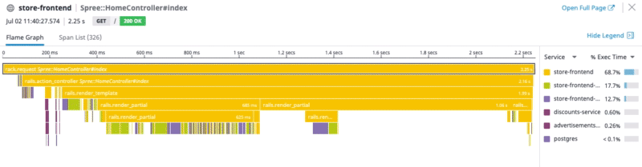

Inefficient database queries can affect service performance, and cause upstream degradations felt by end users. N+1 queries are a common example in which a database is queried multiple times to retrieve data that can be retrieved with just a single query. 

1. In the **store-frontend service page**, scroll to the **Endpoints**  and click **Spree::HomeController#index** endpoint to navigate to <a href="https://app.datadoghq.com/apm/resource/store-frontend/rack.request/69d105fa043dba7f?end=1593549125250&env=intro-apm&index=apm-search&paused=false&start=1593545525250&query=env%3Aintro-apm%20service%3Astore-frontend%20operation_name%3Arack.request%20resource_name%3A%22Spree%3A%3AHomeController%23index%22" target="_datadog">**APM** > **Services** > **store-frontend** > **Spree::HomeController#index**</a>.

2. In the **Span Summary**, click the **AVG SPANS/TRACE** column header to sort the column in descending order. 

    The top two spans are linked to two Postgres queries. There are Spans here with over 200 spans per trace! Something is definitely going on with the database query to be producing so many spans for a single trace.

3. Scrolling down to the **Traces**, click on any span. 

4. In the **Flame Graph**, identify the **discounts.status */discounts*** span. While still hovering that span you can scroll up to zoom in for a better view. 

    1. As you zoom in, notice the high amount of spans from the two queries you saw listed in the Span Summary in step 2 above. This is a textbook N+1 query visualized.
    
     
    
    Fixing this N+1 query by replacing it with a single query that retrieves the same data will result in more efficient data retrieval.

5. Click `discounts.py`{{open}}.

6. Update **line 29** to `discounts = Discount.query.options(joinedload('*')).all()`. (See the note on lines 27-28). 

7. In the Traces list in <a href="https://app.datadoghq.com/apm/resource/store-frontend/rack.request/69d105fa043dba7f?end=1593549125250&env=intro-apm&index=apm-search&paused=false&start=1593545525250&query=env%3Aintro-apm%20service%3Astore-frontend%20operation_name%3Arack.request%20resource_name%3A%22Spree%3A%3AHomeController%23index%22" target="_datadog">**APM** > **Services** > **store-frontend** > **Spree::HomeController#index**</a>, wait until you see new traces coming in.

8. Click a new trace and zoom in on the `postgres.query` span below the **discounts.status */discounts***. Notice that this is only one span now.

    

As you've seen in this activity, Datadog APM enables you to investigate and diagnose a variety of issues that affect performance of services and endpoints in your applications.