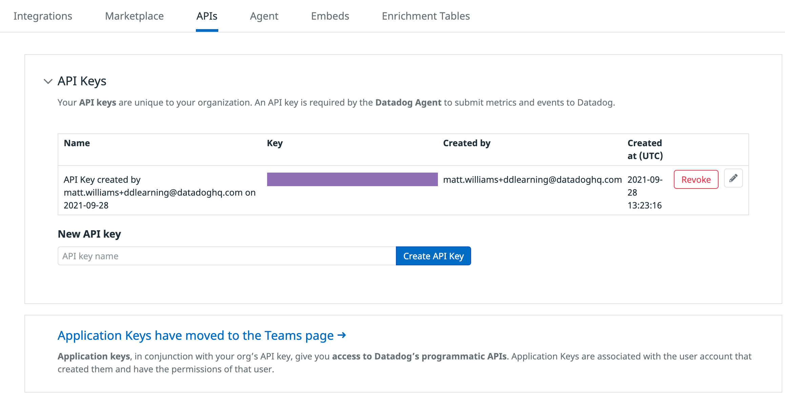

Welcome to the first section of the workshop.

Before doing clicking or doing anything in the environment, allow the lab to finish loading. You will know it is complete when you see the message:

```
Provisioning Complete

A Datadog account has been created for you. 
You can login at http://app.datadoghq.com using
the following credentials:
```

1. Take a look at the command listed below. See the little curled arrow icon that appears next to it? That means it's a clickable command. Just click it and the command will be copied to the terminal and executed.

    `ls -la`{{execute}}

1. You have your lab instructions on the left, a terminal on the bottom right, and a Visual Studio Code IDE tabs on the towards the top of the pane. Whenever working in the IDE, your work will be **saved automatically**.

    You'll also find a tab titled "Storedog", which you'll learn more about soon.

1. Now login to your <a href="https://app.datadoghq.com" target="_datadog">Datadog account</a>. In the terminal on the right you should see login information for the account we created for you. Later if you forget the login information, run `creds`{{execute}} and you will see the information again.

1. Now verify that you are in the right organization. Visit <a href="https://app.datadoghq.com/account/settings#api" target="_datadog">the API Keys section</a>, which you can find in the Global Navigation under **Integrations > APIs**. Expand API Keys and hover over the purple rectangle to reveal the API key we have created for you.



1. In the Training Lab terminal, run the command `echo $DD_API_KEY`{{execute}} to see the API key environment variable. Verify that this is the same API key. You don't have to memorize the entire key. Just making sure that the first and last couple of characters are the same should be good enough to ensure a match.  

    _Note: API and Application keys are different._

    If this is not the same API key that you saw in your Datadog account, you may have been in the wrong organization. You can switch organizations by clicking on the Account menu in the Datadog nav bar and selecting the new organization we created for you.

1. Now that you have verified that you are in the correct organization, move on to read about the application you'll use to learn about the Datadog Deployment Tracking.

## Storedog

In the terminal on the right, the environment is set up with Kubernetes and a deployment of Storedog. Storedog is an e-commerce application that you can interact with via the StoredogV1 tab located to your right at the top of the terminal.

In the terminal on the right, you should see credentials for a newly provisioned Datadog trial account. Open a new window/tab and use the provided credentials to log into the [Datadog](https://app.datadoghq.com/account/login) platform.

**Note**: You can access these login credentials whenever you need by typing `creds` in the terminal.

Run `kubectl get all`{{execute}} in the terminal to the right by clicking the code snippet, this will show you all the kubernetes resources that comprise our application.


Click the StoredogV1 tab at the top of your terminal to the right. Take a look around and generate some traffic.

Since you started this lab, a background process has been automatically making requests to the Storedog app. Between this traffic and the traffic you created while clicking around Storedog, you should have a good amount of activity to look at in the Datadog Platform. Next, you need to get the Datadog agent running in your cluster to collect data from Storedog. You can use our simple one line Helm install command. Once everyone is ready, we will move on and run our helm install.
