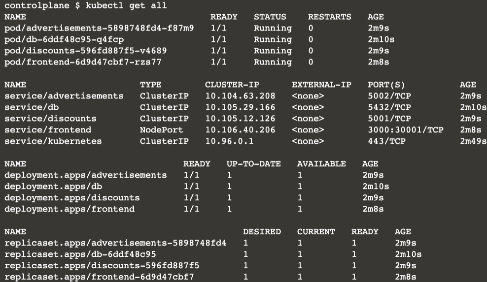

In the terminal on the right, the environment is set up with Kubernetes and a deployment of Storedog. Storedog is an e-commerce application that you can interact with via the StoredogV1 tab located to your right at the top of the terminal.

In the terminal on the right, you should see credentials for a newly provisioned Datadog trial account. Open a new window/tab and use the provided credentials to log into the [Datadog](https://app.datadoghq.com/account/login) platform.

**Note**: You can access these login credentials whenever you need by typing `creds` in the terminal.

Run `kubectl get all`{{execute}} in the terminal to the right by clicking the code snippet, this will show you all the kubernetes resources that comprise our application.

Click the StoredogV1 tab at the top of your terminal to the right. Take a look around and generate some traffic.

Since you started this lab, a background process has been automatically making requests to the Storedog app. Between this traffic and the traffic you created while clicking around Storedog, you should have a good amount of activity to look at in the Datadog Platform. Next, you need to get the Datadog agent running in your cluster to collect data from Storedog. You can use our simple one line Helm install command. Once everyone is ready, we will move on and run our helm install.
