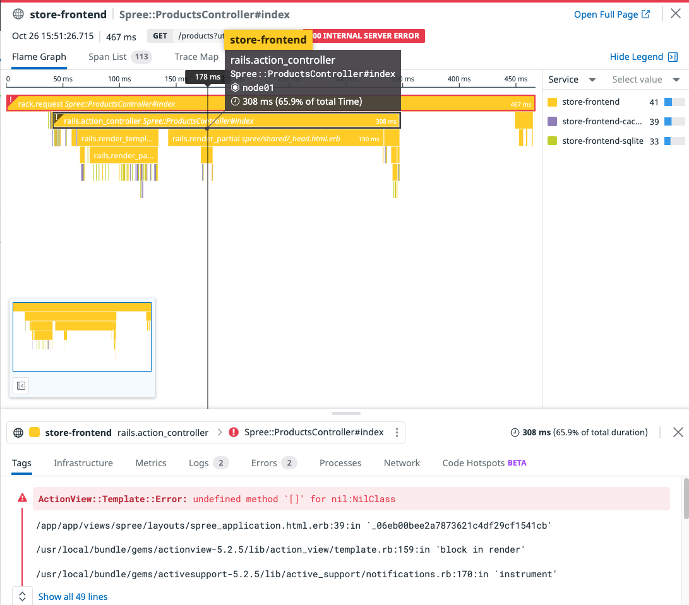
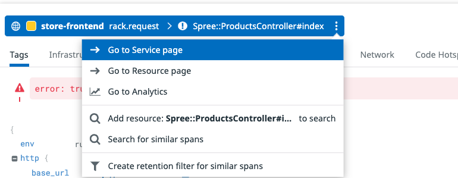
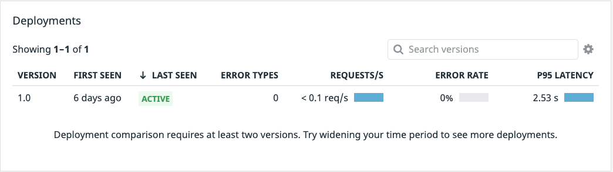

With the application running and the Datadog agents installed, navigate to [APM > Traces](https://app.datadoghq.com/apm/traces?env=ruby-shop). You may need to wait a minute or so for data to show up in Datadog. Once traces begin flowing in, navigate to the [APM > Services](https://app.datadoghq.com/apm/services?env=ruby-shop) page and you should see a list of the services that comprise Storedog. 

With the [Service List](https://app.datadoghq.com/apm/services?env=ruby-shop), we get a high level view of overall service performance and can quickly see services that are running slower than the rest. When working with a team migrating to microservices, this view can be a great first approach to breaking down existing problems.

For example, if we look at the [Frontend Service](https://app.datadoghq.com/apm/service/store-frontend), we can see errors coming in by navigating to the [APM > Traces](https://app.datadoghq.com/apm/traces?start=1620938913331&end=1620939813331&paused=false) page. Now on the left hand side navigation filter for `Status > Error` and `Service > store-frontend`. Errors are not a good experience for our end users. 

Let's go ahead and click on one of our traces to bring up the full view. We can see when investigating the flame graph that there is a template error coming in. 

Let's go directly from this view to our Frontend Service page to see if we can pinpoint what is going on. 

Now that we are on the Frontend Service page, we can scroll down to the endpoints panel and see there are two endpoints in particular that are substantially slower than the rest...

Both the `HomeController#index` and the `ProductController#show` endpoints are showing *much* longer latency times. If we click in and view a trace, we'll see that we've got a downstream microservice taking up a substantial portion of our time.

Heading back to the [APM > Services](https://app.datadoghq.com/apm/services?env=ruby-shop) and clicking the `advertisements` service, down just below the `Latency Distribution` graph you should see the `Deployments` section. 

Version `1.0` of the `advertisements` deployment is running and to the far right you will see its very high P95 latency. `P95` refers to the 95th percentile of latency. This means that 95% of your users are experiencing a latency equal to the P95 latency or lower. 

Since we currently only have one version deployed, there is no way to get any kind of deployment comparison data. The latency issue will need to be fixed to see if an improvement can be made over the `1.0` deployment, fixing the latency and application crashes. 

Thankfully, the engineers have gone ahead and built a new advertisements image, and even provided a new manifest which should *hopefully* fix users latency issues. Let's make sure we have updated the version tag to `1.1` so Datadog will pickup the change and start gathering data on the new deployment. Let's move to the next step and make these changes and deploy.