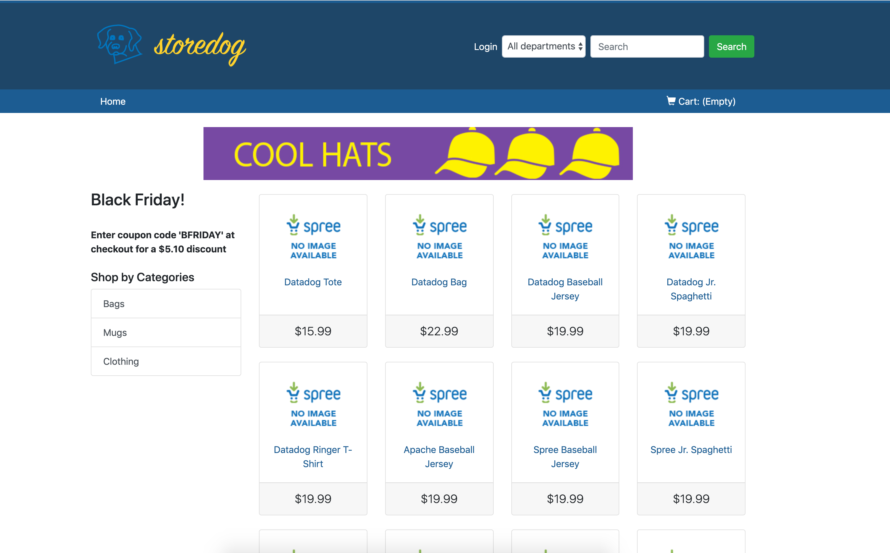

Our legacy monolith shop uses Ruby on Rails and Spree. We've started to build out a first set of microservices, and these have been added to an initial set of containers.

We will use `docker-compose` to get our ecommerce application, Storedog, up and running. There's a prebuilt Rails Docker container image, along with the new Python / Flask microservice which will handle our Coupon codes and Ads which display in the store.

In this workshop, we're going to spin up and instrument our application to see where things are broken, and next, find a few bottlenecks.

We'll focus on thinking through what observability might make sense in a real application, and see how setting up observability works in practice.

## Log into the Datadog Trial Account

In the terminal on the right, you'll see credentials for a newly provisioned Datadog trial account. Open a new private/incognito window and use the provided credentials to log into [Datadog](https://app.datadoghq.com/account/login).

**Note:** You can access these login credentials whenever you need by typing `creds` in the terminal.

## Starting Storedog

At the start of this workshop the repo for our application was cloned in the background from Github. If we change into the directory, we can start the code with the following:

`cd ../ecommworkshop/deploy/docker-compose`{{execute}}

`POSTGRES_USER=postgres POSTGRES_PASSWORD=postgres docker-compose -f docker-compose-broken-instrumented.yml up`{{execute}}

Once our images are pulled, we will be able to view the application. You can either:

1. Click the `storedog` tab to the right of Terminal to view the application

1. Navigate to [Storedog](https://[[HOST_SUBDOMAIN]]-3000-[[KATACODA_HOST]].environments.katacoda.com/) via URL in a new tab or window.

Take a moment to navigate the site. Try browsing around, and notice the homepage takes a very long time to load. 

## Generating Traffic for Our Site

We've got a capture of "production" traffic using GoReplay. In our `/ecommworkshop/deploy/docker-compose` folder, you will see a container we created called `docker-compose-traffic-replay`. This container will send "production" traffic to our application on a consistent basis to help generate data for us on the platform.

Click the "+" sign next to the `storedog` tab. Next, click `Open New Terminal`.

`cd ../ecommworkshop/deploy/docker-compose`{{execute}}

`docker-compose -f docker-compose-traffic-replay.yml up`{{execute}}

Once the traffic replay begins, we can take a look at the issues we've seen since the team rolled out their first few microservices.

There have been reports that the new `advertisements-service` broke the website after the new deployment in the development environment. The `frontend` team has blamed the `ads-service` team, and the `advertisements-service` team has blamed the ops team.

We'll use the Datadog APM trace library to instrumented our code. Let's see what's *really* been breaking our application.
