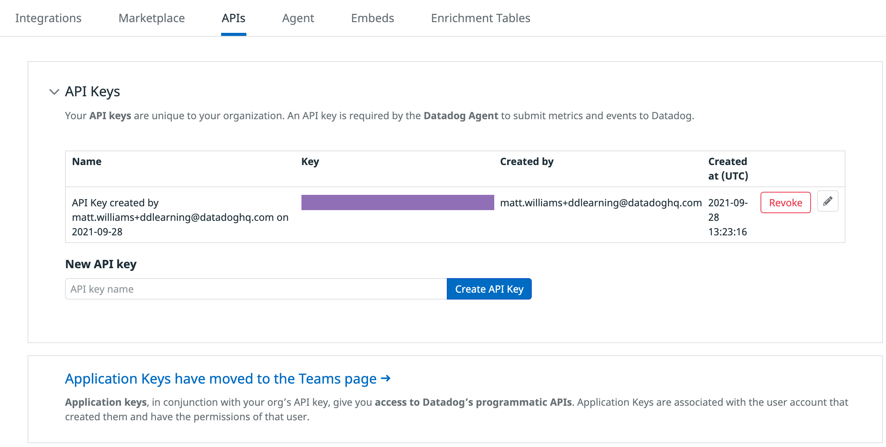

Welcome to the first section of the workshop.

Before doing clicking or doing anything in the environment, allow the lab to finish loading. You will know it is complete when you see the message:

```
Provisioning Complete

A Datadog account has been created for you. 
You can login at http://app.datadoghq.com using
the following credentials:
```

1. You have your lab instructions on the left and a terminal on the right. On the top of your terminal is another tab which will oen Visual Studio Code IDE tab. Whenever working in the IDE, your work will be **saved automatically**.

    You'll also find a tab titled "Storedog", which you'll learn more about soon.

1. Take a look at the command listed below. See the little curled arrow icon that appears next to it? That means it's a clickable command. Just click it and the command will be copied to the terminal and executed.

    `ls -la`{{execute}}

1. In the terminal on the right you should see login information for the account we created for you. Later if you forget the login information, run `creds`{{execute}} and you will see the information again. Now , using the provided credentials, login to your account on<a href="https://app.datadoghq.com" target="_datadog">Datadog </a>. 

1. Now that you are logged into the platform , visit <a href="https://app.datadoghq.com/account/settings#api" target="_datadog">the API Keys section</a>, which you can find in the Global Navigation under **Integrations > APIs**. Expand API Keys and hover over the purple rectangle to reveal the API key we have created for you.



1. In the Training Lab terminal, run the command `echo $DD_API_KEY`{{execute}} to see the API key environment variable. Verify that this is the same API key. You don't have to memorize the entire key. Just making sure that the first and last couple of characters are the same should be good enough to ensure a match.  

    _Note: API and Application keys are different._

    If this is not the same API key that you saw in your Datadog account, you may have been in the wrong organization. You can switch organizations by clicking on the Account menu in the Datadog nav bar and selecting the new organization we created for you.

1. Now that you have verified that you are in the correct organization, move on to read about the application you'll use to learn about Service Focused Observability with Datadog APM.

## Storedog

In this workshop you're going to work with Storedog, a fully functional e-commerce application running on a few Docker containers managed by Docker Compose.

The Datadog Community team created this application for use in the Learning Center, workshops, and demos.

1. Click the IDE tab and wait for the editor to load. It takes a bit.

    Open the `docker-compose.yml`{{open}} file and review how these services are configured. 

2. The application is already running. To see the containers and their statuses, execute the following command in the terminal:

    `docker-compose ps`{{execute}}

3. Select the tab titled "Storedog" in the right-hand panel. This will open up Storedog as a new tab in your browser. You might need to refresh until the frontend service is fully responsive.

    

4. Take a few moments and explore the application before moving on. You'll use this application throughout the rest of the workshop to learn about different components about the Datadog platform.

5. At the end of every section of this workshop, including this one, run `finish`{{execute}} when you are finished. 

