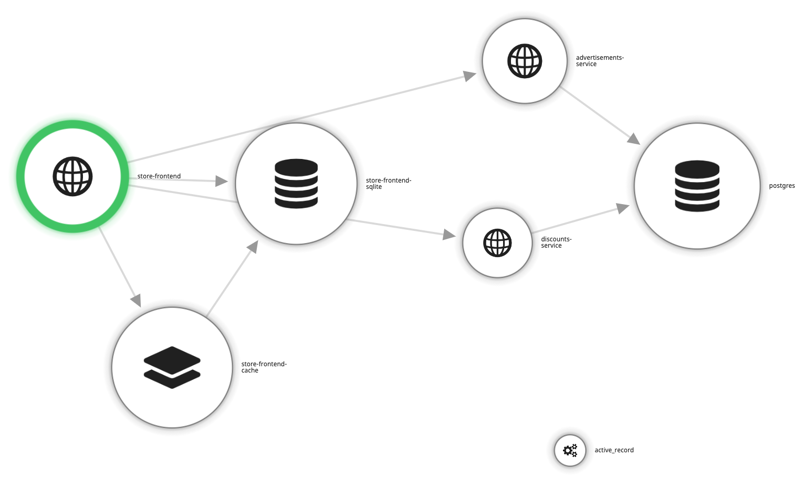
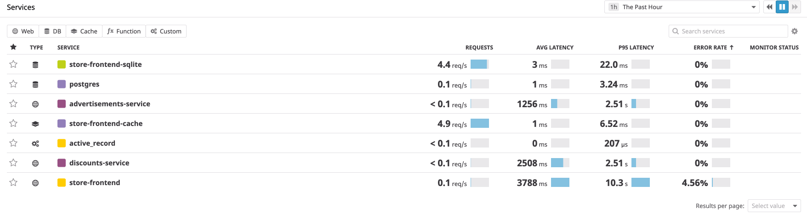
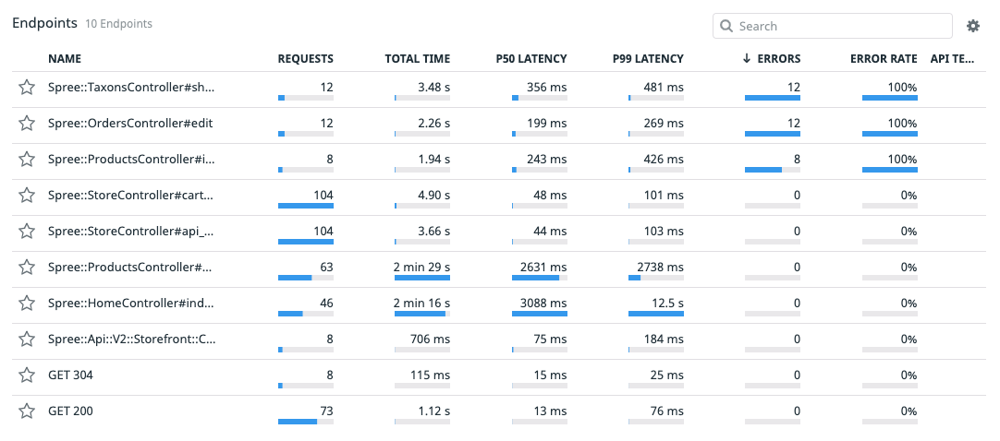
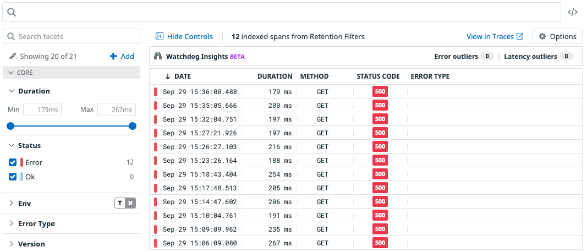
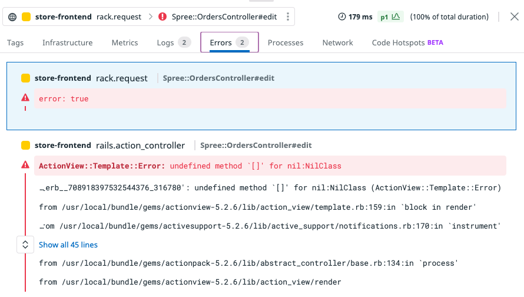

We'll start by looking at the Service Map, to get an idea for our current infrastructure and microservice dependencies.



In doing so, we can tell that we've got two microservices that our frontend calls, a `discounts-service`, along with an `advertisements-service`.

If we navigate to our Service List in Datadog, we can see which services are throwing any errors, at a glance.



So let's take a look at the frontend service, and see if we can find the spot where things are breaking.

If we look into the service, we can see that it's been laid out by views. There's at least one view that seems to only give errors.



Let's click into that view and see if a trace from that view can tell us what's going on.



It seems the problem happens in a template. Let's get rid of that part of the template so we can get the site back up and running while figuring out what happened.



## Reviewing Code Changes for the Fix

After passing this information to our developers, they reported the following fixes have been deployed to a new Docker image named `ddtraining/storefront-fixed:latest`. Let's review these fixes before deploying the new image.

Our developers can see that they'll need to open `spree_application.html.erb`{{open}} and delete the line under `<div class="container">`. It should begin with a `<br />` and end with a `</center>`.

In this case, the banner ads were meant to be put under `show.html.erb`{{open}} and `index.html.erb`{{open}}

For the `index.html.erb`, under `<div data-hook="homepage_products">` our developers needed to add the code:

```ruby
<br /><center><a href="<%= @ads['url'] %>">" /></a></center>

```

And for `show.html.erb` this was added to the very bottom:

```ruby 
<br /><center><a href="<%= @ads['url'] %>">" /></a></center><br />
```

## Deploying the Fixed Code

Since this code has already been deployed to the new Docker image `ddtraining/storefront-fixed:latest`, we just need to update our config to use the new image.

Edit the `docker-compose.yml`{{open}}, changing the `frontend` image on line 60:

```
  image: "ddtraining/storefront-fixed:2.0.0"
```

It's also recommended to update the `DD_VERSION` so that we can track performance changes across versions. Let's set this to `2.1`.

With the updates in place, we need to restart our service. Click back over to our terminal and restart our services with: `docker-compose up -d`{{execute}}

This will start up our application using the changes made to the yaml file. Let's see if there's anything else going on.
