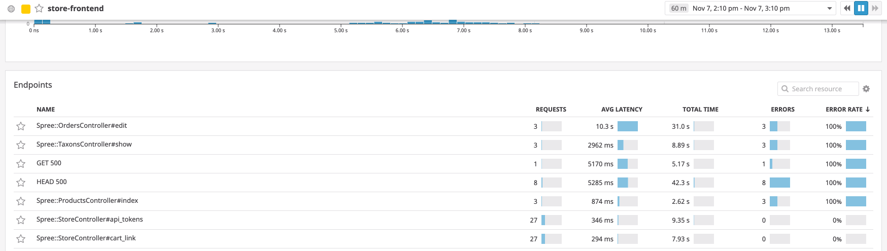
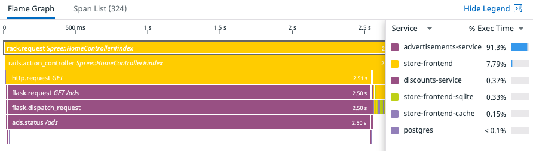

With the [Service List](https://app.datadoghq.com/apm/services?env=sfo101), we get a high level view of overall service performance. We can quickly see services that are running slower than the rest. When working with a team migrating to microservices, this view can be a great first approach to breaking down existing problems.

As we click into the Overview Page of the [Frontend Service](https://app.datadoghq.com/apm/service/store-frontend), we can see there are two endpoints in particular that are substantially slower than the rest.

Both the `HomeController#index` and the `ProductController#show` enpoints are showing *much* longer latency times. If we click in and view a trace, we'll see that we've got a downstream microservice taking up a substantial portion of our time.

It seems the `advertisements-service` is taking over 2.5 seconds for each request. Click on the Spans to look at the Tags for the specific url and path group, then we'll check the code to see if we can spot the problem.

The path group is `/ads`. The source code for this path is in the file: `ads.py`{{open}}

Looking at the code, it appears we've accidentally left a line in from testing what happens if latency goes up. Try spotting the line and removing the code to see if you can bring the latency down again.

Since this is a simple fix, let's take care of this on our own.

**Hint:** Look for `flask_request.method == 'GET'` 

Before we restart the services, open the `docker-compose.yml`{{open}} file and find the `advertisements` settings starting on line 75. Update the `DD_VERSION` to `2.1` then restart the service using `docker-compose down && docker-compose up -d`{{execute}}

What sort of an improvement in page load time do you see now? Can you graph the differences over time?

**Hint:** We'll want to look at the `/ads` endpoint of the `advertisements-service`.
