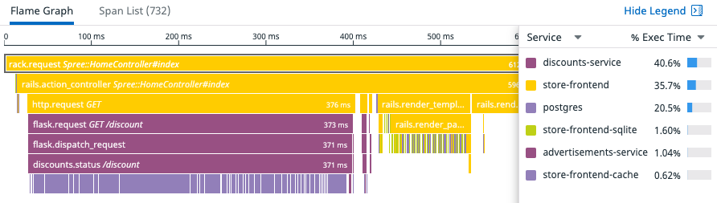

As we've already seen, on the Service Overview, we can see at a glance endpoints that are running slower than the rest.

Now that we've reduced the response time on our `/ads` requests, let's see if we can fix one more problematic endpoint.

Let's look at the Store-Frontend service's `HomeController#index` again. The `advertisements-service` is no longer taking up so much time, but we see another service is still taking up a lot of time during the trace.

Jump to the Resource page by clicking on the `flask.request GET /discount` span. Above the Tags click the kebab menu icon to directly access the Resource page.

Look over the Span Summary page. Is there a specific span that's occurring much more often than the others? Maybe something with a higher Average Spans per trace?

It looks like we've got a classic N+1 query on our `discounts-service`. From the Trace Flame Graph, there appears to be a *lot* of trips to the database for each request. We can likely improve this performance by reducing these multiple trips to the database.

Open the source code file: `discounts.py`{{open}} and locate the `flask_request.method == 'GET'` section. There will be a line of code which states what happened, with a fix. Uncomment the suggested changes right under the view definition, and comment out line 29.

With this, we've now made a great first attempt at improving the experience for our users. Let's once again update the `DD_VERSION` number in `docker-compose.yml`{{open}}. Find the `discounts` service block at line 18. Update the `DD_VERSION` to `2.1`.

Restart the service using: `docker-compose up -d`{{execute}}

With this, we can now start back up our application, and see the difference in traces between our previous and current improvements.