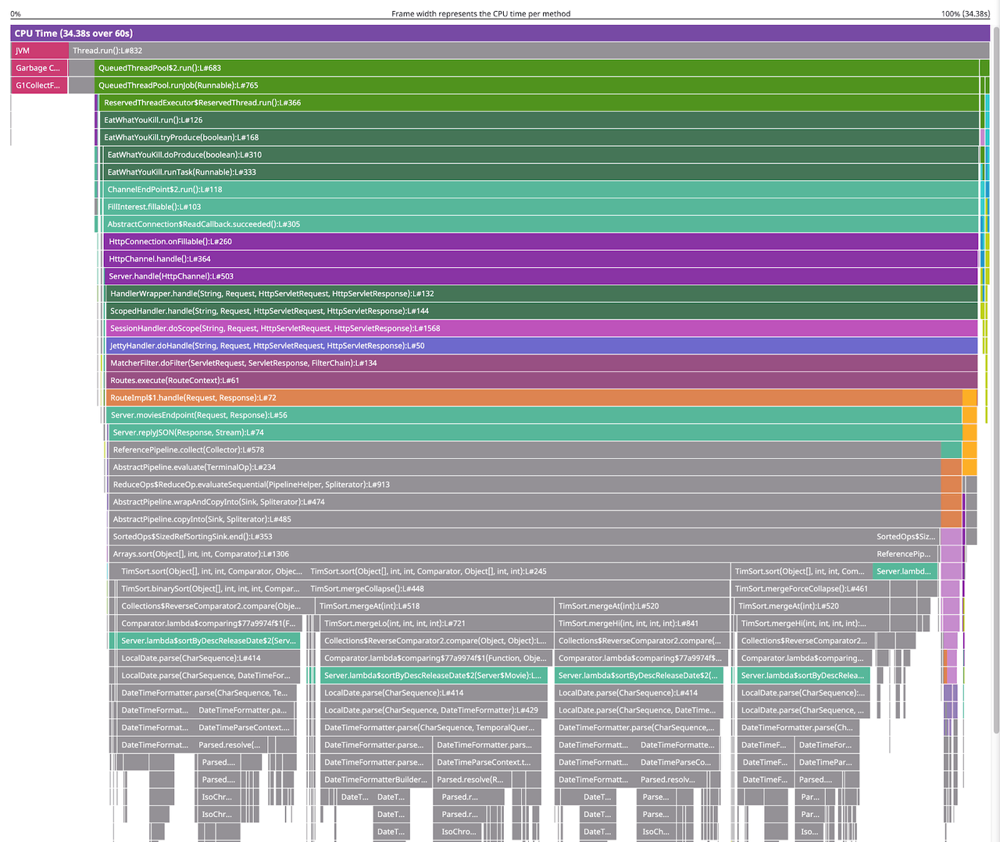
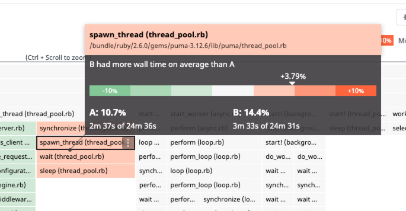
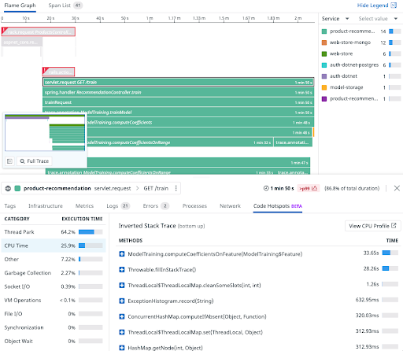

# Continuous Profiling

A profiler shows how much “work” each function is doing by collecting data about the program as it’s running. For example, if infrastructure monitoring shows your app servers are using 80% of their CPU, you may not know why. Profiling shows a breakdown of the work.

When working on performance problems, this information is important because many programs spend a lot of time in a few places, which may not not be obvious. Guessing at which parts of a program to optimize causes engineers to spend a lot of time with little results. By using a profiler, you can find exactly which parts of the code to optimize.

The Datadog Continuous Profiler can track various types of “work”, including CPU usage, amount and types of objects being allocated in memory, time spent waiting to acquire locks, amount of network or file I/O, and more. The profile types available depend on the language being profiled

### Profiler Flame Graph

This is a flame graph. The most important things it shows are how much CPU each method used (since this is a CPU profile) and how each method was called. For example, reading from the second row from the top, you see that `Thread.run()` called `QueuedThreadPool$2.run()` (amongst other things), which called `QueuedThreadPool.runjob(Runnable)`, which called `ReservedTheadExecutor$ReservedThread.run()`, and so on.

### View Profiles Along Side Traces

The Continuous Profiler can compare two profiles or profile aggregations with each other to help you identify code performance improvements, regressions, and structural changes. You can compare a profile with:
 * Profiles taken at a different time,
 * An average of the service’s profiles over time, or
 * Profiles with a different set of Datadog tags (for example, environment, version, or data center).

### Comparing Recent Versions
On the Aggregation view, select a service to see its aggregated profile for a particular metric over the selected time frame. Then click *Compare* to compare it to the aggregated profile of another version

If your application is showing performance problems in production, it’s helpful to connect the distributed trace information from APM with the full profile of the code stack. Application processes that have both APM distributed tracing and continuous profiler enabled are automatically linked. So you can move directly from span information to profiling data on the *Code Hotspots* tab, and find specific lines of code related to performance issues.
