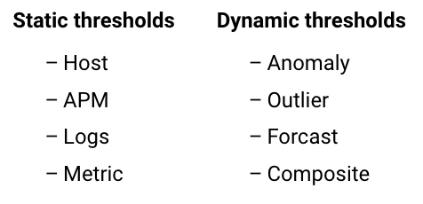
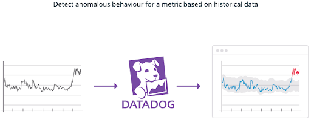
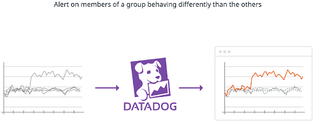
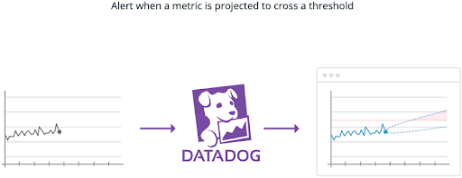

## Adding Monitors to Our Services

Navigate to the [Datadog Services list](https://app.datadoghq.com/apm/services) page. When we hover over each of the services, we see *View Suggested* under the *Monitors* column. These are built-in monitors that can be quickly and easily created for our services. Monitors can oversee different aspects of our services to ensure we have visibility into our application, even when we are not looking. We can configure a monitor and allow it to observe our application, sending alerts to various channels when it's triggered.

Let's add one of these monitors so we can tell when our applications latency has risen too high, ensuring we are quickly alerted and are able to fix the issue.

In this case, we are going to enable the default suggested `P90` latency monitor to the `store-frontend`, so we can tell when things are taking too long to respond.

## Monitor Types

There are multiple monitor types available at Datadog. They fall into 2 categories. Static and Dynamic thresholds. Some examples of static thresholds are Host, APM, Logs and Metric. These static types or straightforward. CPU over 95%, Error rate over 10%, etc.

Datadog also has dynamic threshold monitors, which use algorithms to notify on anomalous behavior, use predictive forecasting, or evaluate multiple monitors with boolean operators. For a full list of Monitor types, visit the [Datadog Monitor Types documentation](https://docs.datadoghq.com/monitors/create/types/).

## Dynamic Monitors

The first dynamic monitor type we’ll discuss is the Anomaly monitor. This uses a series of algorithms which can be configured to monitor the historical behavior of a metric. If we see the same pattern every day at a certain time or on a specific day of the week, this is expected behavior. But if we deviate from this norm, we can alert. This type of monitor can be useful for metrics that have a lot of variability.

For example, anomaly detection can help you discover when your web traffic is unusually low on a weekday afternoon—even if that same level of traffic is normal later in the evening.

**Note:** Anomaly detection requires historical data to make good predictions. If you have only been collecting a metric for a few hours or days, anomaly detection won’t be useful.

Outlier monitors can look at the behavior of a group and alert if members of that group behave differently.

Maybe you have a pool of web servers and one begins processing more requests than the others or less than the others. You know it should be handling more requests. Perhaps it’s dropped out of the pool or having errors. Or maybe you’re seeing a high number of errors from your web servers, but only from a specific AWS availability zone. An Outlier monitor can alert you when this anomalous behavior occurs.

Like Anomaly monitors, the Forecast monitor will look at historical data and predict where it will be. This is especially useful for consumable resources such as disk space. With a Forecast monitor you can be notified before a disk becomes full so that you can run a cleanup process or grow a volume as needed.

You can also use this monitor to forecast business metrics you may be collecting, like user sign-ups to track a target.
