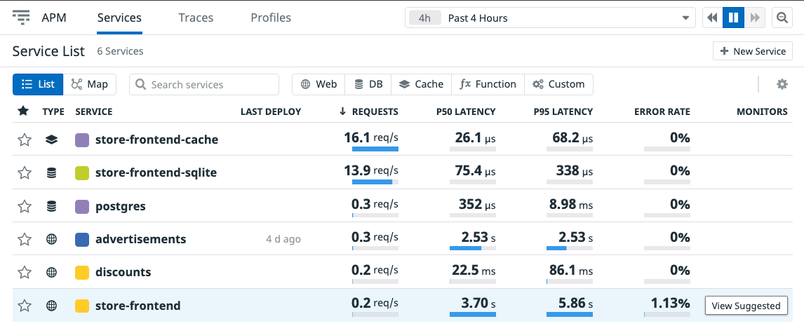

# Adding Monitors to Our Services

Navigate to the [Datadog Services list](https://app.datadoghq.com/apm/services) page. When we hover over each of the services, we see *View Suggested* under the *Monitors* column. These are built-in monitors that can be quickly and easily created for our services. Monitors can oversee different aspects of our services to ensure we have visibility into our application, even when we are not looking. We can configure a monitor and allow it to observe our application, sending alerts to various channels when it's triggered.

Let's add one of these monitors so we can tell when our applications latency has risen too high, ensuring we are quickly alerted and are able to fix the issue.

In this case, we are going to enable the default suggested `P90` latency monitor to the `store-frontend`, so we can tell when things are taking too long to respond.